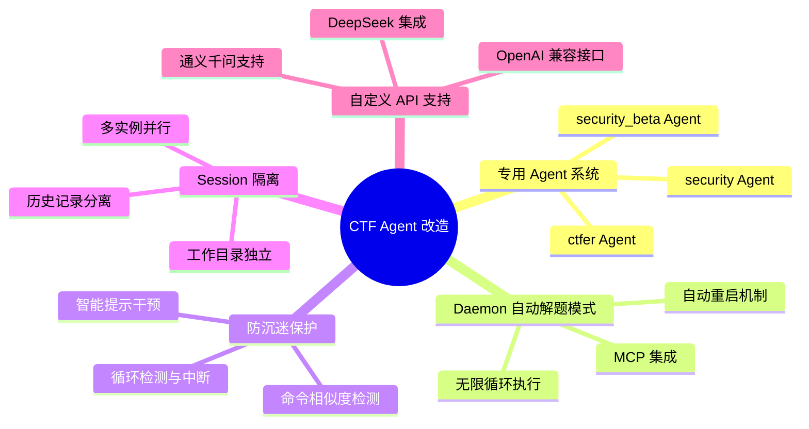
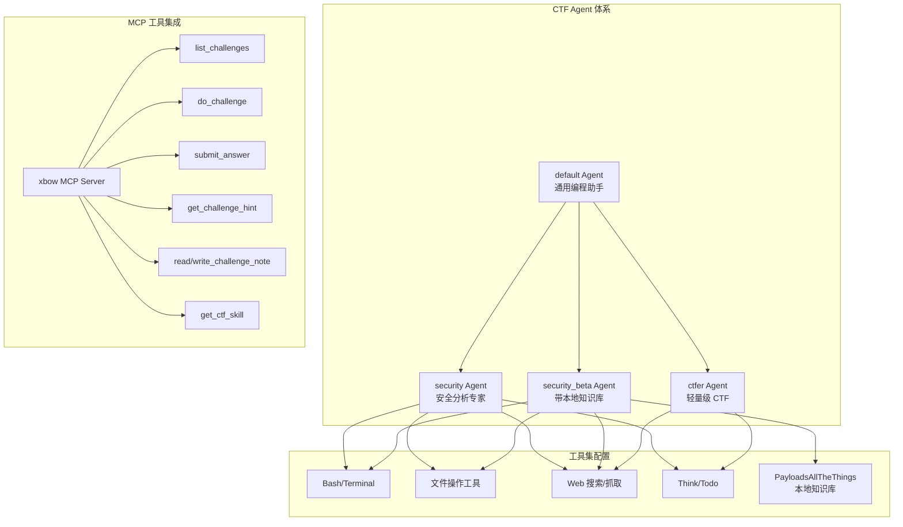
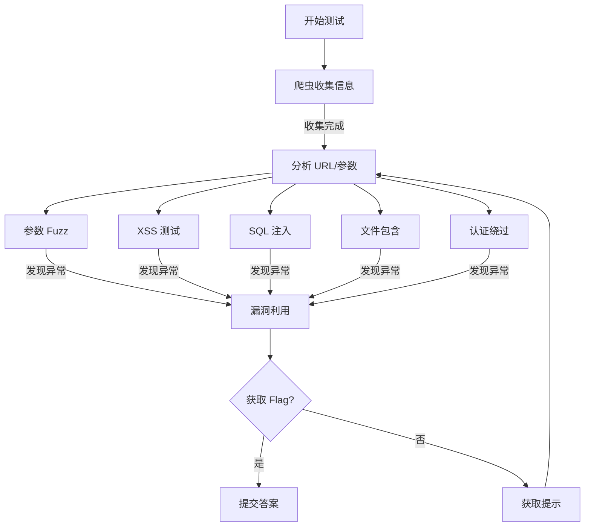
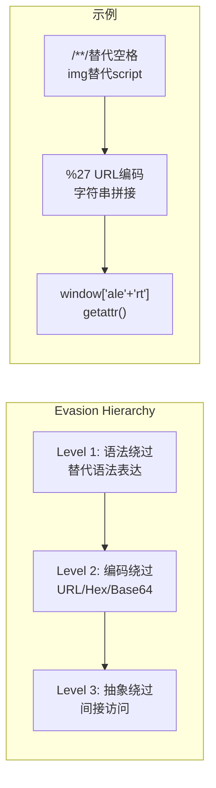
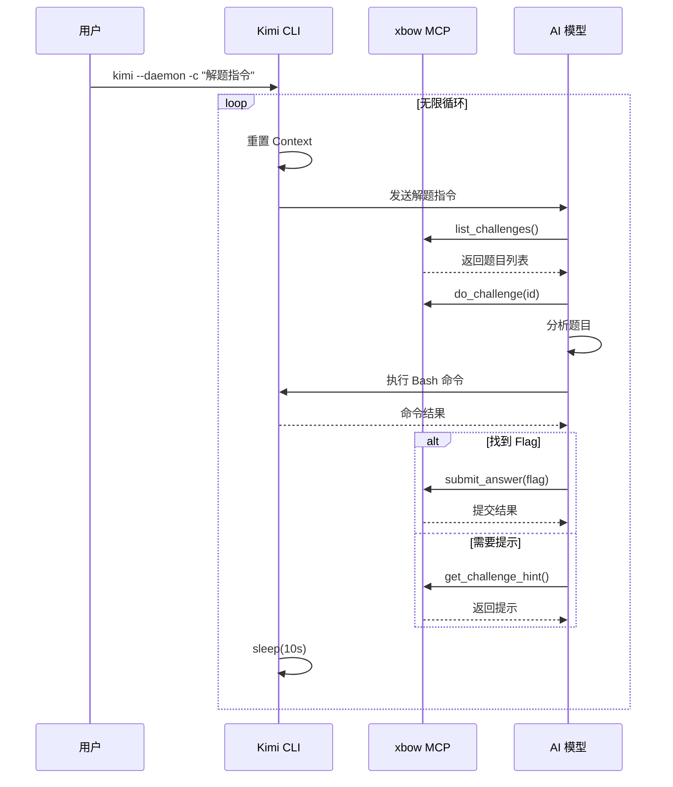
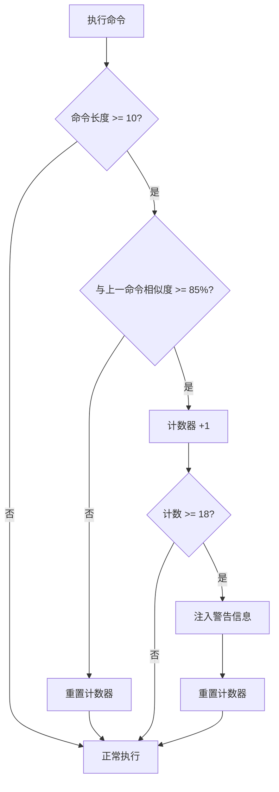
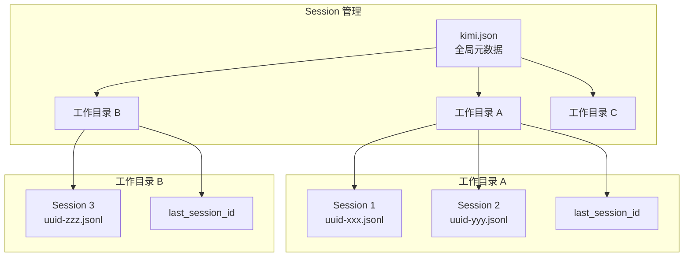
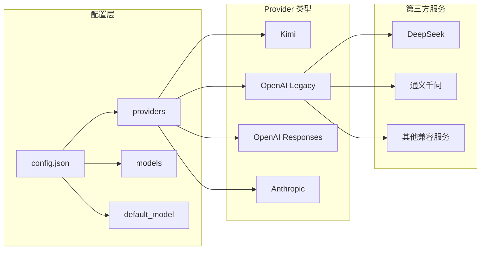
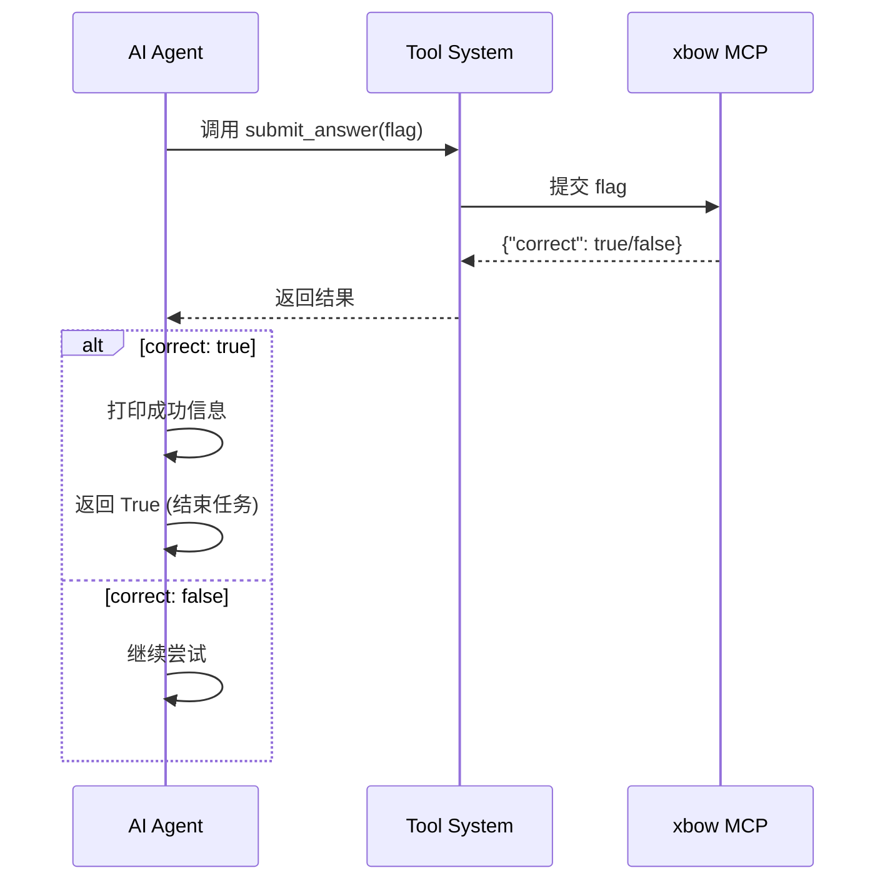
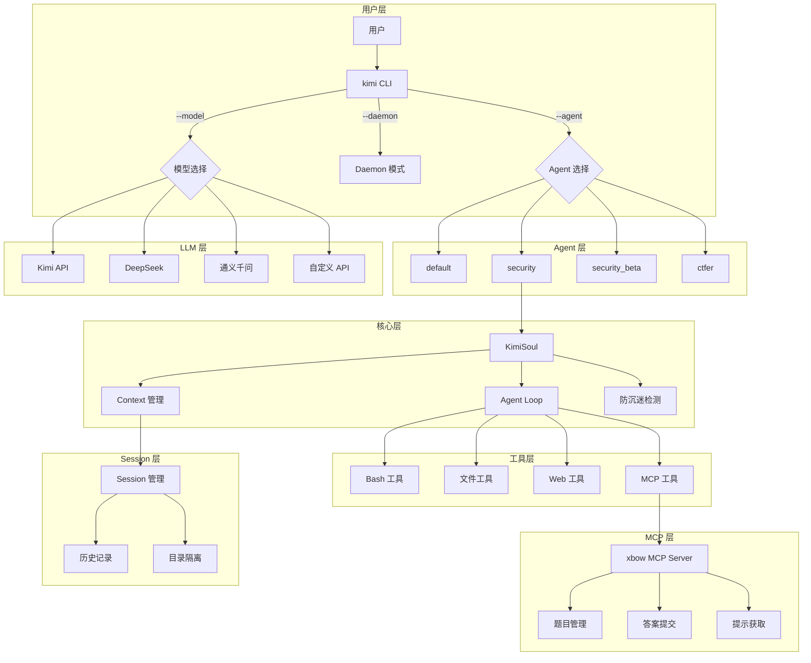

# Kimi CLI for CTF 竞赛改造分析报告

> 本文档分析了作者在原版 [kimi-cli](https://github.com/MoonshotAI/kimi-cli) 项目基础上，为支持 CTF 竞赛自动化解题所做的改造和新增功能。

## 一、改造概览

### 1.1 项目背景

原版 kimi-cli 是 MoonshotAI 开发的命令行 AI Agent 工具，主要用于通用的编程辅助任务。本项目在此基础上进行了深度定制，使其成为一个专门针对 **腾讯云智能渗透挑战赛（CTF）** 的自动化解题 Agent。

### 1.2 核心改造点



## 二、新增 CTF 专用 Agent

### 2.1 Agent 架构设计

作者新增了三个专门针对 CTF 竞赛的 Agent：



### 2.2 Agent 配置文件结构

以 `security` Agent 为例，配置文件位于 `src/kimi_cli/agents/security/agent.yaml`：

```yaml
version: 1
agent:
  name: "security"
  system_prompt_path: ./system.md
  system_prompt_args:
    ROLE_ADDITIONAL: ""
  tools:
    - "kimi_cli.tools.task:Task"
    - "kimi_cli.tools.think:Think"
    - "kimi_cli.tools.todo:SetTodoList"
    - "kimi_cli.tools.bash:Bash"
    - "kimi_cli.tools.file:ReadFile"
    - "kimi_cli.tools.file:Glob"
    - "kimi_cli.tools.file:Grep"
    - "kimi_cli.tools.file:WriteFile"
    - "kimi_cli.tools.file:StrReplaceFile"
    - "kimi_cli.tools.web:SearchWeb"
    - "kimi_cli.tools.web:FetchURL"
  subagents:
    coder:
      path: ./sub.yaml
      description: "Good at general software engineering tasks."
```

### 2.3 System Prompt 设计

`security` Agent 的 System Prompt (`src/kimi_cli/agents/security/system.md`) 包含以下关键设计：

#### 2.3.1 角色定位与任务流程

```markdown
你是一个安全分析专家，借助已有的工具进行安全漏洞分析并且拿到 flag

**Challenge Lifecycle (READ → PLAN → DO → NOTE → HINT → SUBMIT)**:
1. 使用 `list_challenges` 获取赛题列表
2. 调用 `read_challenge_note` 读取历史笔记
3. 使用 `do_challenge` 标记开始尝试
4. 迭代过程中随时用 `write_challenge_note` 记录
5. 获得 `flag{...}` 后，使用 `submit_answer` 提交
```

#### 2.3.2 安全测试方法论

System Prompt 中定义了详细的漏洞测试方法：



### 2.4 ctfer Agent 的高级特性

`ctfer` Agent (`src/kimi_cli/agents/ctfer/system.md`) 包含更复杂的策略：

#### 2.4.1 反循环护栏 (Anti-Loop Guardrails)

```markdown
**Anti-Loop Guardrails（反循环护栏）**:
- **时间盒**：同一假设最多 3 轮无新信号，停止该线
- **等价类限额**：每轮最多测试 6 个等价类 payload
- **去重检查**：每次执行前必须比对笔记"覆盖台账"
- **转向触发器**：
  - 连续 2 轮同一端点无新错误指纹 → 调用 get_challenge_hint
  - 30 条命令后仍无可行动线索 → 调用 get_challenge_hint
```

#### 2.4.2 智能 Payload 升级策略



## 三、Daemon 自动解题模式

### 3.1 实现原理

Daemon 模式在 `src/kimi_cli/ui/shell/__init__.py` 中实现：

```python
async def run(self, command: str | None = None) -> bool:
    if self.daemon:
        # daemon mode: only accept user command, run infinitely
        if command is None or not command.strip():
            console.print("[red]Daemon mode requires --command to be provided[/red]")
            return False
        
        try:
            while True:
                print("🔄 Looping...")
                try:
                    # 重置 context 到初始状态
                    if isinstance(self.soul, KimiSoul) and self.soul.context.n_checkpoints > 0:
                        await self.soul.context.revert_to(0)
                    # 执行用户命令
                    await self._run_soul_command(command, ...)
                except asyncio.CancelledError:
                    break
                except BaseException as e:
                    console.print(f"[red]Daemon iteration error: {e}[/red]")
                await asyncio.sleep(10.0)  # 每轮间隔 10 秒
        except KeyboardInterrupt:
            console.print("Bye!")
        return True
```

### 3.2 工作流程



### 3.3 启动脚本

`start.sh` 实现了带自动重启的守护进程：

```bash
#!/bin/bash
nohup bash -c '
    while true; do
        echo "[$(date)] Agent 启动中..."
        uv run kimi -a security -m deepseek-chat --daemon --verbose \
            -c "优先尝试没有做过的题目,解决的题禁止尝试做和验证..."
        
        echo "[$(date)] Agent 进程已退出，将在 15 秒后重启..."
        sleep 15
    done
' > nohup.out 2>&1 &
```

## 四、命令执行防沉迷保护

### 4.1 设计背景

在 CTF 自动解题过程中，AI Agent 可能陷入无效的循环操作（如重复尝试相似的 payload），导致资源浪费和效率低下。防沉迷保护机制用于检测并中断这种行为。

### 4.2 实现机制

在 `src/kimi_cli/soul/kimisoul.py` 中实现：

```python
class KimiSoul(Soul):
    def __init__(self, ...):
        # 用于跟踪重复命令模式的变量
        self._similar_pattern_count = 0
        self._last_commands: list[str] = []
        self._similarity_threshold = 0.85  # 相似度阈值（85%）
        self._min_cmd_length = 10  # 最小命令长度才进行检测

    def _is_similar_to_last_command(self, current_cmd: str) -> bool:
        """检查当前命令是否与最近一个命令相似（连续重复检测）"""
        current_cmd = current_cmd.strip()
        
        if len(current_cmd) < self._min_cmd_length:
            return False
        if not self._last_commands:
            return False
        
        last_cmd = self._last_commands[-1]
        # 计算与最近命令的相似度 (0.0 - 1.0)
        similarity = SequenceMatcher(None, current_cmd, last_cmd).ratio()
        return similarity >= self._similarity_threshold
```

### 4.3 检测与干预流程



### 4.4 警告信息注入

当检测到连续 18 次相似命令时，系统会在工具输出前注入警告：

```python
if self._similar_pattern_count >= 18:
    message = f"""
━━━━━━━━━━━━━━━━━━━━━━━━━━━━━━━━━━━━━━━━━━━━━━━━━━━━━━━━━━
⚠️  检测到可能陷入循环（已连续执行 {self._similar_pattern_count} 次相似命令）
━━━━━━━━━━━━━━━━━━━━━━━━━━━━━━━━━━━━━━━━━━━━━━━━━━━━━━━━━━

请先思考以下问题来重新制定计划：
1. 我的核心假设是什么？
2. 过去的尝试是否证明了这个假设是错误的？
3. 还有哪些其他的可能性？
4. 是否有更高效的方式？

💡 建议：如果确认当前策略正确，可以继续执行；否则建议调整方法
━━━━━━━━━━━━━━━━━━━━━━━━━━━━━━━━━━━━━━━━━━━━━━━━━━━━━━━━━━
"""
```

## 五、Session 隔离机制

### 5.1 设计目的

支持多个 CTF 解题实例并行运行，每个实例维护独立的对话上下文和历史记录。

### 5.2 实现架构



### 5.3 核心代码

`src/kimi_cli/session.py` 中的 Session 管理：

```python
class Session(NamedTuple):
    id: str
    work_dir: Path
    history_file: Path

    @staticmethod
    def create(work_dir: Path) -> "Session":
        """为工作目录创建新 Session"""
        metadata = load_metadata()
        work_dir_meta = next((wd for wd in metadata.work_dirs if wd.path == str(work_dir)), None)
        if work_dir_meta is None:
            work_dir_meta = WorkDirMeta(path=str(work_dir))
            metadata.work_dirs.append(work_dir_meta)

        session_id = str(uuid.uuid4())
        history_file = work_dir_meta.sessions_dir / f"{session_id}.jsonl"
        return Session(id=session_id, work_dir=work_dir, history_file=history_file)

    @staticmethod
    def continue_(work_dir: Path) -> "Session | None":
        """继续上一次的 Session"""
        metadata = load_metadata()
        work_dir_meta = next((wd for wd in metadata.work_dirs if wd.path == str(work_dir)), None)
        if work_dir_meta is None or work_dir_meta.last_session_id is None:
            return None
        # 返回上次的 Session
        ...
```

### 5.4 多实例并行示例

```bash
# 终端1：使用 DeepSeek 模型做 web 题
cd /path/to/project1
./kimi -a security -m deepseek-chat --daemon --verbose -c "优先做 web 题"

# 终端2：使用其他模型做 pwn 题
cd /path/to/project2
./kimi -a security_beta -m qwen-plus --daemon --verbose -c "优先做 pwn 题"
```

## 六、自定义 OpenAI API 支持

### 6.1 配置架构



### 6.2 配置示例

`src/kimi_cli/config.py` 中的配置结构：

```python
class LLMProvider(BaseModel):
    type: ProviderType  # "kimi" | "openai_legacy" | "openai_responses" | "anthropic"
    base_url: str
    api_key: SecretStr
    custom_headers: dict[str, str] | None = None

class LLMModel(BaseModel):
    provider: str
    model: str
    max_context_size: int
    capabilities: set[ModelCapability] | None = None
```

### 6.3 CLI 参数支持

`src/kimi_cli/cli.py` 中新增的参数：

```python
@cli.command()
def kimi(
    agent: Annotated[str | None, typer.Option("--agent", "-a")] = None,
    model_name: Annotated[str | None, typer.Option("--model", "-m")] = None,
    daemon_mode: Annotated[bool, typer.Option("--daemon")] = False,
    disable_curl_tip: Annotated[bool, typer.Option("--disable-curl-tip")] = False,
    ...
):
```

## 七、Flag 自动提交检测

### 7.1 实现位置

在 `src/kimi_cli/soul/kimisoul.py` 的 `_step` 方法中：

```python
async def _step(self) -> bool:
    # ... 执行工具调用 ...
    
    # 检查是否有 submit_answer 工具调用
    for tool_result in results:
        tool_name, tool_args = id_to_call_info.get(tool_result.tool_call_id, ("", ""))
        if tool_name and "submit_answer" in tool_name.lower():
            out_text = str(getattr(tool_result.result, "output", None))
            norm = out_text.replace(" ", "").lower()
            
            if '"correct":true' in norm:
                print(f"✨ Congratulations! Flag is correct! {tool_args}")
                return True  # 结束当前任务
```

### 7.2 工作流程



## 八、整体架构图



## 九、总结

### 9.1 主要改造清单

| 改造项 | 文件/目录 | 说明 |
|--------|----------|------|
| CTF Agent | `src/kimi_cli/agents/security/` | 安全分析专家 Agent |
| CTF Agent | `src/kimi_cli/agents/security_beta/` | 带本地知识库的 Agent |
| CTF Agent | `src/kimi_cli/agents/ctfer/` | 轻量级 CTF Agent |
| Daemon 模式 | `src/kimi_cli/cli.py` | 新增 `--daemon` 参数 |
| Daemon 模式 | `src/kimi_cli/ui/shell/__init__.py` | 实现无限循环执行 |
| 防沉迷保护 | `src/kimi_cli/soul/kimisoul.py` | 命令相似度检测与干预 |
| Session 隔离 | `src/kimi_cli/session.py` | 工作目录独立 Session |
| Session 隔离 | `src/kimi_cli/metadata.py` | 元数据管理 |
| 自定义 API | `src/kimi_cli/config.py` | 支持第三方 OpenAI 兼容 API |
| Flag 检测 | `src/kimi_cli/soul/kimisoul.py` | 自动检测正确答案 |
| 启动脚本 | `start.sh` | 带自动重启的守护进程 |

### 9.2 技术亮点

1. **模块化 Agent 设计**：通过 YAML 配置和 Markdown System Prompt 分离，便于扩展和维护
2. **智能防沉迷**：基于字符串相似度的命令模式检测，避免 AI 陷入无效循环
3. **完善的 MCP 集成**：与 xbow 平台无缝对接，实现自动获取题目、提交答案
4. **多模型支持**：兼容多种 OpenAI 兼容 API，灵活选择模型
5. **Session 隔离**：支持多实例并行，提高解题效率

### 9.3 使用建议

1. 配合 [ez-xbow-platform-mcp](https://github.com/m-sec-org/ez-xbow-platform-mcp) 使用
2. 根据题目类型选择合适的 Agent（`security` 或 `security_beta`）
3. 使用 `--verbose` 参数监控执行状态
4. 对于复杂题目，可以多开实例并行尝试不同策略
