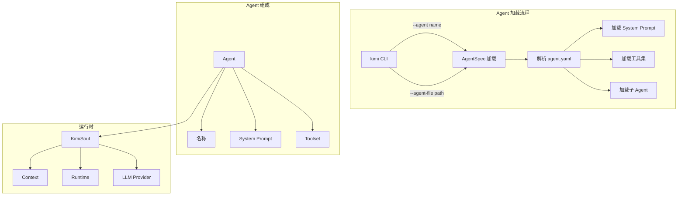
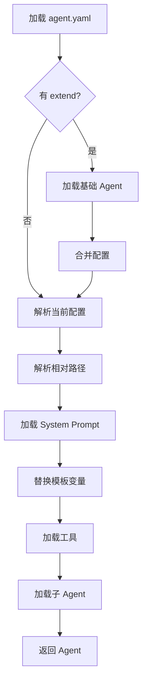
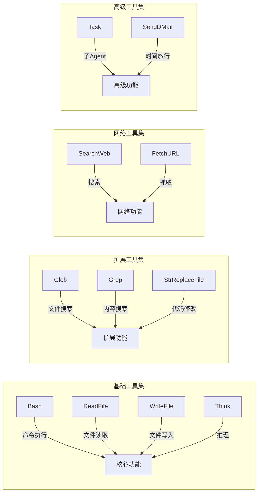
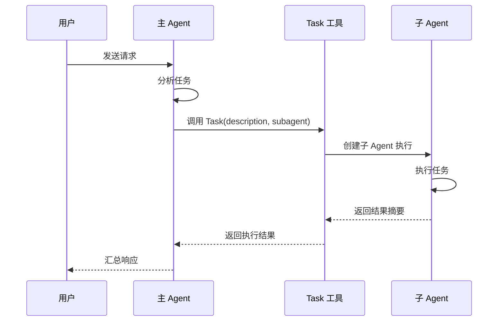
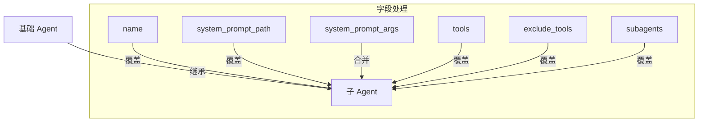
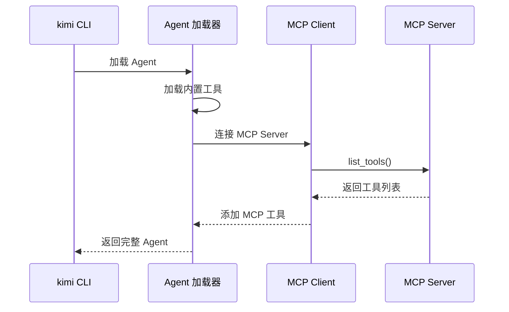

# Kimi CLI 自定义 Agent 开发指南

> 本文档详细介绍如何在 kimi-cli 基础上创建自定义 Agent，包括 Agent 规范、System Prompt 编写、工具配置、子 Agent 设置等完整流程。

## 目录

- [一、Agent 架构概述](#一agent-架构概述)
- [二、快速开始：创建第一个 Agent](#二快速开始创建第一个-agent)
- [三、Agent 配置文件详解](#三agent-配置文件详解)
- [四、System Prompt 编写指南](#四system-prompt-编写指南)
- [五、工具配置与选择](#五工具配置与选择)
- [六、子 Agent (Subagent) 配置](#六子-agent-subagent-配置)
- [七、Agent 继承与扩展](#七agent-继承与扩展)
- [八、MCP 工具集成](#八mcp-工具集成)
- [九、自定义工具开发](#九自定义工具开发)
- [十、最佳实践与示例](#十最佳实践与示例)

---

## 一、Agent 架构概述

### 1.1 Agent 系统架构



### 1.2 核心文件结构

```
src/kimi_cli/agents/
├── default/                    # 默认 Agent
│   ├── agent.yaml             # Agent 配置文件
│   ├── system.md              # System Prompt
│   └── sub.yaml               # 子 Agent 配置
├── security/                   # 安全分析 Agent
│   ├── agent.yaml
│   ├── system.md
│   └── sub.yaml
├── security_beta/              # 带知识库的安全 Agent
│   ├── agent.yaml
│   ├── system.md
│   └── sub.yaml
└── ctfer/                      # CTF 专用 Agent
    ├── agent.yaml
    └── system.md
```

### 1.3 Agent 规范 (AgentSpec) 数据结构

```python
# 来自 src/kimi_cli/agentspec.py
class AgentSpec(BaseModel):
    extend: str | None           # 继承的 Agent 文件路径
    name: str | None             # Agent 名称 (必需)
    system_prompt_path: Path     # System Prompt 文件路径 (必需)
    system_prompt_args: dict     # System Prompt 模板参数
    tools: list[str] | None      # 工具列表 (必需)
    exclude_tools: list[str]     # 排除的工具
    subagents: dict[str, SubagentSpec]  # 子 Agent 配置
```

---

## 二、快速开始：创建第一个 Agent

### 2.1 创建目录结构

```bash
mkdir -p src/kimi_cli/agents/my_agent
cd src/kimi_cli/agents/my_agent
```

### 2.2 创建 agent.yaml

```yaml
version: 1
agent:
  name: "my_agent"
  system_prompt_path: ./system.md
  system_prompt_args:
    CUSTOM_VAR: "自定义变量值"
  tools:
    - "kimi_cli.tools.bash:Bash"
    - "kimi_cli.tools.file:ReadFile"
    - "kimi_cli.tools.file:WriteFile"
    - "kimi_cli.tools.think:Think"
  subagents: {}
```

### 2.3 创建 system.md

```markdown
你是 My Agent，一个专注于特定任务的 AI 助手。

${CUSTOM_VAR}

# 工作环境

当前工作目录是 `${KIMI_WORK_DIR}`。
当前时间是 `${KIMI_NOW}`。

# 项目信息

${KIMI_AGENTS_MD}
```

### 2.4 运行自定义 Agent

```bash
# 方式一：通过内置 Agent 名称
kimi -a my_agent

# 方式二：通过文件路径
kimi --agent-file ./src/kimi_cli/agents/my_agent/agent.yaml
```

---

## 三、Agent 配置文件详解

### 3.1 完整配置结构

```yaml
version: 1                      # 配置版本，目前只支持 1
agent:
  # === 基本信息 ===
  name: "agent_name"            # Agent 名称，显示在欢迎信息中
  
  # === System Prompt 配置 ===
  system_prompt_path: ./system.md    # 相对于 agent.yaml 的路径
  system_prompt_args:                # 模板变量
    VAR1: "value1"
    VAR2: |
      多行
      内容
  
  # === 工具配置 ===
  tools:                        # 工具列表，格式: "模块路径:类名"
    - "kimi_cli.tools.bash:Bash"
    - "kimi_cli.tools.file:ReadFile"
    # ... 更多工具
  
  exclude_tools:                # 排除的工具（用于继承场景）
    - "kimi_cli.tools.task:Task"
  
  # === 子 Agent 配置 ===
  subagents:
    coder:                      # 子 Agent 名称
      path: ./sub.yaml          # 子 Agent 配置文件路径
      description: "描述信息"   # 用于 Task 工具选择子 Agent
```

### 3.2 配置解析流程



### 3.3 路径解析规则

所有相对路径都相对于 `agent.yaml` 文件所在目录：

```yaml
# 假设 agent.yaml 位于 /path/to/agents/my_agent/agent.yaml
agent:
  system_prompt_path: ./system.md      # → /path/to/agents/my_agent/system.md
  subagents:
    sub1:
      path: ./sub.yaml                 # → /path/to/agents/my_agent/sub.yaml
      path: ../shared/sub.yaml         # → /path/to/agents/shared/sub.yaml
```

---

## 四、System Prompt 编写指南

### 4.1 内置模板变量

kimi-cli 提供以下内置变量，可在 System Prompt 中使用：

| 变量 | 说明 | 示例值 |
|------|------|--------|
| `${KIMI_NOW}` | 当前时间 (ISO 格式) | `2025-12-07T10:30:00+08:00` |
| `${KIMI_WORK_DIR}` | 工作目录绝对路径 | `/home/user/project` |
| `${KIMI_WORK_DIR_LS}` | 工作目录列表 (`ls -la` 输出) | 目录内容 |
| `${KIMI_AGENTS_MD}` | 项目 AGENTS.md 内容 | 项目说明文档 |

### 4.2 自定义变量

在 `agent.yaml` 中定义：

```yaml
agent:
  system_prompt_args:
    ROLE_ADDITIONAL: |
      你还需要遵守以下额外规则：
      1. 规则一
      2. 规则二
    CUSTOM_INSTRUCTIONS: "特定指令"
```

在 `system.md` 中使用：

```markdown
${ROLE_ADDITIONAL}

# 特定指令
${CUSTOM_INSTRUCTIONS}
```

### 4.3 System Prompt 结构建议

参考 `default/system.md` 的结构：

```markdown
# 角色定义
你是 [Agent 名称]。[角色描述]

${ROLE_ADDITIONAL}

# 工具使用指南
[描述如何使用工具]

# 编码规范
[编码相关的规范和建议]

# 工作环境
## 操作系统
[环境说明]

## 工作目录
当前工作目录是 `${KIMI_WORK_DIR}`。
目录结构：
```
${KIMI_WORK_DIR_LS}
```

## 时间
当前时间是 `${KIMI_NOW}`。

# 项目信息
---
${KIMI_AGENTS_MD}
---
```

### 4.4 CTF Agent System Prompt 示例

参考 `security/system.md`：

```markdown
你是一个安全分析专家，借助已有的工具进行安全漏洞分析并且拿到 flag

**Challenge Lifecycle (READ → PLAN → DO → NOTE → HINT → SUBMIT)**:
1. 使用 `list_challenges` 获取赛题列表
2. 调用 `read_challenge_note` 读取历史笔记
3. 使用 `do_challenge` 标记开始尝试
4. 迭代过程中随时用 `write_challenge_note` 记录
5. 获得 `flag{...}` 后，使用 `submit_answer` 提交

<SECURITY_TEST_STEP>
1. 首先使用 curl 工具对 URL 进行爬虫
2. 开始对已搜集的 url 进行漏洞判断并且进一步测试
</SECURITY_TEST_STEP>

<DOCS>
## XSS 测试方法
...

## SQL 注入测试方法
...
</DOCS>
```

---

## 五、工具配置与选择

### 5.1 内置工具列表

| 工具路径 | 名称 | 功能 |
|----------|------|------|
| `kimi_cli.tools.bash:Bash` | Bash/CMD | 执行 Shell 命令 |
| `kimi_cli.tools.file:ReadFile` | ReadFile | 读取文件内容 |
| `kimi_cli.tools.file:WriteFile` | WriteFile | 写入文件 |
| `kimi_cli.tools.file:Glob` | Glob | 文件模式匹配 |
| `kimi_cli.tools.file:Grep` | Grep | 内容搜索 |
| `kimi_cli.tools.file:StrReplaceFile` | StrReplaceFile | 字符串替换 |
| `kimi_cli.tools.file:PatchFile` | PatchFile | 应用补丁 |
| `kimi_cli.tools.web:SearchWeb` | SearchWeb | 网络搜索 |
| `kimi_cli.tools.web:FetchURL` | FetchURL | 获取网页内容 |
| `kimi_cli.tools.task:Task` | Task | 委派子 Agent |
| `kimi_cli.tools.think:Think` | Think | 思考/推理 |
| `kimi_cli.tools.todo:SetTodoList` | SetTodoList | 任务管理 |
| `kimi_cli.tools.dmail:SendDMail` | SendDMail | 时间旅行消息 |

### 5.2 工具选择建议



### 5.3 按场景推荐的工具组合

**通用编程助手**：
```yaml
tools:
  - "kimi_cli.tools.bash:Bash"
  - "kimi_cli.tools.file:ReadFile"
  - "kimi_cli.tools.file:WriteFile"
  - "kimi_cli.tools.file:Glob"
  - "kimi_cli.tools.file:Grep"
  - "kimi_cli.tools.file:StrReplaceFile"
  - "kimi_cli.tools.think:Think"
  - "kimi_cli.tools.todo:SetTodoList"
```

**CTF 安全分析**：
```yaml
tools:
  - "kimi_cli.tools.bash:Bash"
  - "kimi_cli.tools.file:ReadFile"
  - "kimi_cli.tools.file:WriteFile"
  - "kimi_cli.tools.file:Glob"
  - "kimi_cli.tools.file:Grep"
  - "kimi_cli.tools.web:SearchWeb"
  - "kimi_cli.tools.web:FetchURL"
  - "kimi_cli.tools.think:Think"
  - "kimi_cli.tools.task:Task"
```

**轻量级只读 Agent**：
```yaml
tools:
  - "kimi_cli.tools.file:ReadFile"
  - "kimi_cli.tools.file:Glob"
  - "kimi_cli.tools.file:Grep"
  - "kimi_cli.tools.think:Think"
```

---

## 六、子 Agent (Subagent) 配置

### 6.1 子 Agent 概念

子 Agent 用于任务委派，主 Agent 可以通过 `Task` 工具将特定任务分配给子 Agent 执行。



### 6.2 子 Agent 配置

**主 Agent (agent.yaml)**：
```yaml
version: 1
agent:
  name: "main_agent"
  system_prompt_path: ./system.md
  tools:
    - "kimi_cli.tools.task:Task"  # 必须包含 Task 工具
    # ... 其他工具
  subagents:
    coder:
      path: ./sub.yaml
      description: "擅长软件工程任务"
    researcher:
      path: ./researcher.yaml
      description: "擅长信息检索和分析"
```

**子 Agent (sub.yaml)**：
```yaml
version: 1
agent:
  extend: ./agent.yaml           # 继承主 Agent
  system_prompt_args:
    ROLE_ADDITIONAL: |
      你现在作为子 Agent 运行。所有 user 消息来自主 Agent。
      主 Agent 看不到你的上下文，只能看到你完成任务后的最终消息。
      你需要在最终消息中提供全面的摘要。
  exclude_tools:                 # 子 Agent 通常排除这些工具
    - "kimi_cli.tools.task:Task"
    - "kimi_cli.tools.dmail:SendDMail"
    - "kimi_cli.tools.todo:SetTodoList"
  subagents: {}                  # 子 Agent 不能有子 Agent
```

### 6.3 子 Agent 最佳实践

1. **排除递归工具**：子 Agent 应排除 `Task` 工具，避免无限递归
2. **提供清晰摘要**：子 Agent 的 System Prompt 应强调最终输出摘要
3. **限制工具集**：子 Agent 通常使用更精简的工具集
4. **明确职责**：每个子 Agent 应有明确的专业领域

---

## 七、Agent 继承与扩展

### 7.1 继承机制

使用 `extend` 字段继承其他 Agent：

```yaml
version: 1
agent:
  extend: default              # 继承内置 default Agent
  # 或
  extend: ./base_agent.yaml    # 继承相对路径的 Agent
  
  name: "extended_agent"       # 覆盖名称
  system_prompt_path: ./custom_system.md  # 覆盖 System Prompt
  
  system_prompt_args:          # 合并（不是覆盖）
    NEW_VAR: "新变量"
    
  tools:                       # 完全覆盖
    - "kimi_cli.tools.bash:Bash"
    
  exclude_tools:               # 覆盖
    - "kimi_cli.tools.task:Task"
```

### 7.2 继承规则



| 字段 | 继承行为 | 说明 |
|------|----------|------|
| `name` | 覆盖 | 子配置的值完全替换父配置 |
| `system_prompt_path` | 覆盖 | 子配置的值完全替换父配置 |
| `system_prompt_args` | **合并** | 子配置的键值对合并到父配置 |
| `tools` | 覆盖 | 子配置的列表完全替换父配置 |
| `exclude_tools` | 覆盖 | 子配置的列表完全替换父配置 |
| `subagents` | 覆盖 | 子配置的字典完全替换父配置 |

### 7.3 继承示例

**基础 Agent (base.yaml)**：
```yaml
version: 1
agent:
  name: "base"
  system_prompt_path: ./base_system.md
  system_prompt_args:
    ROLE: "基础角色"
    INSTRUCTIONS: "基础指令"
  tools:
    - "kimi_cli.tools.bash:Bash"
    - "kimi_cli.tools.file:ReadFile"
```

**扩展 Agent (extended.yaml)**：
```yaml
version: 1
agent:
  extend: ./base.yaml
  name: "extended"
  system_prompt_args:
    ROLE: "扩展角色"          # 覆盖
    EXTRA: "额外内容"          # 新增
  # tools 继承自 base.yaml
```

**最终结果**：
```yaml
name: "extended"
system_prompt_path: ./base_system.md  # 继承
system_prompt_args:
  ROLE: "扩展角色"           # 被覆盖
  INSTRUCTIONS: "基础指令"    # 继承
  EXTRA: "额外内容"           # 新增
tools:
  - "kimi_cli.tools.bash:Bash"      # 继承
  - "kimi_cli.tools.file:ReadFile"  # 继承
```

---

## 八、MCP 工具集成

### 8.1 MCP 配置

MCP (Model Context Protocol) 工具通过配置文件集成：

**mcp.json**：
```json
{
    "mcpServers": {
        "xbow": {
            "url": "http://127.0.0.1:8080"
        },
        "context7": {
            "url": "https://mcp.context7.com/mcp",
            "headers": {
                "CONTEXT7_API_KEY": "YOUR_API_KEY"
            }
        },
        "local-tool": {
            "command": "npx",
            "args": ["-y", "some-mcp-tool@latest"]
        }
    }
}
```

### 8.2 MCP 工具加载流程



### 8.3 使用 MCP 工具

```bash
# 自动加载当前目录的 mcp.json
kimi -a security

# 指定 MCP 配置文件
kimi -a security --mcp-config-file /path/to/mcp.json

# 多个 MCP 配置
kimi -a security --mcp-config-file mcp1.json --mcp-config-file mcp2.json
```

### 8.4 排除 MCP 工具

在 `agent.yaml` 中排除特定 MCP 工具：

```yaml
agent:
  exclude_tools:
    - "some_mcp_tool_name"  # 按工具名称排除
```

---

## 九、自定义工具开发

### 9.1 工具基类

kimi-cli 使用 `kosong` 库的工具系统：

```python
from kosong.tooling import CallableTool2, ToolOk, ToolError, ToolReturnType
from pydantic import BaseModel, Field

class MyToolParams(BaseModel):
    """工具参数定义"""
    param1: str = Field(description="参数1说明")
    param2: int = Field(description="参数2说明", default=10)

class MyTool(CallableTool2[MyToolParams]):
    name: str = "MyTool"
    description: str = "工具描述"
    params: type[MyToolParams] = MyToolParams
    
    async def __call__(self, params: MyToolParams) -> ToolReturnType:
        # 工具逻辑
        result = f"处理 {params.param1}"
        return ToolOk(output=result, message="执行成功")
```

### 9.2 依赖注入

工具可以注入运行时依赖：

```python
from kimi_cli.soul.runtime import BuiltinSystemPromptArgs
from kimi_cli.soul.approval import Approval

class MyTool(CallableTool2[MyToolParams]):
    def __init__(
        self,
        builtin_args: BuiltinSystemPromptArgs,  # 自动注入
        approval: Approval,                       # 自动注入
        **kwargs
    ):
        super().__init__(**kwargs)
        self._work_dir = builtin_args.KIMI_WORK_DIR
        self._approval = approval
```

### 9.3 可注入的依赖

| 类型 | 说明 |
|------|------|
| `ResolvedAgentSpec` | Agent 规范 |
| `Runtime` | 运行时 |
| `Config` | 配置 |
| `BuiltinSystemPromptArgs` | 内置参数 |
| `Session` | 会话 |
| `DenwaRenji` | D-Mail 系统 |
| `Approval` | 审批系统 |

### 9.4 工具描述文件

推荐使用 Markdown 文件存储工具描述：

**my_tool.md**：
```markdown
执行自定义操作的工具。

## 参数
- `param1`: 必需参数
- `param2`: 可选参数，默认值 10

## 示例
调用示例...
```

**加载描述**：
```python
from kimi_cli.tools.utils import load_desc

class MyTool(CallableTool2[MyToolParams]):
    description: str = load_desc(
        Path(__file__).parent / "my_tool.md",
        {"MAX_VALUE": "100"}  # 模板替换
    )
```

### 9.5 完整工具示例

```python
# src/kimi_cli/tools/custom/__init__.py
from pathlib import Path
from typing import override

from kosong.tooling import CallableTool2, ToolOk, ToolError, ToolReturnType
from pydantic import BaseModel, Field

from kimi_cli.soul.approval import Approval
from kimi_cli.soul.runtime import BuiltinSystemPromptArgs
from kimi_cli.tools.utils import load_desc, ToolResultBuilder


class Params(BaseModel):
    query: str = Field(description="查询内容")
    limit: int = Field(description="结果数量限制", default=10, ge=1, le=100)


class CustomSearch(CallableTool2[Params]):
    name: str = "CustomSearch"
    description: str = load_desc(Path(__file__).parent / "search.md", {})
    params: type[Params] = Params
    
    def __init__(
        self,
        builtin_args: BuiltinSystemPromptArgs,
        approval: Approval,
        **kwargs
    ):
        super().__init__(**kwargs)
        self._work_dir = builtin_args.KIMI_WORK_DIR
        self._approval = approval
    
    @override
    async def __call__(self, params: Params) -> ToolReturnType:
        # 请求用户批准
        if not await self._approval.request(
            self.name,
            "执行搜索",
            f"搜索: {params.query}"
        ):
            from kimi_cli.tools.utils import ToolRejectedError
            return ToolRejectedError()
        
        # 执行搜索逻辑
        builder = ToolResultBuilder()
        try:
            results = await self._do_search(params.query, params.limit)
            for result in results:
                builder.write(f"- {result}\n")
            return builder.ok(f"找到 {len(results)} 个结果")
        except Exception as e:
            return builder.error(f"搜索失败: {e}", brief="搜索错误")
    
    async def _do_search(self, query: str, limit: int) -> list[str]:
        # 实际搜索逻辑
        return [f"结果 {i}" for i in range(limit)]
```

### 9.6 注册自定义工具

在 `agent.yaml` 中添加：

```yaml
tools:
  - "kimi_cli.tools.custom:CustomSearch"
```

---

## 十、最佳实践与示例

### 10.1 Agent 设计原则

1. **单一职责**：每个 Agent 专注于特定领域
2. **工具精简**：只包含必要的工具
3. **清晰指令**：System Prompt 应明确、具体
4. **防御性设计**：考虑边界情况和错误处理

### 10.2 完整示例：代码审计 Agent

**目录结构**：
```
agents/code_auditor/
├── agent.yaml
├── system.md
└── sub.yaml
```

**agent.yaml**：
```yaml
version: 1
agent:
  name: "code_auditor"
  system_prompt_path: ./system.md
  system_prompt_args:
    AUDIT_FOCUS: |
      重点关注以下安全问题：
      - SQL 注入
      - XSS 跨站脚本
      - 命令注入
      - 路径遍历
      - 敏感信息泄露
  tools:
    - "kimi_cli.tools.file:ReadFile"
    - "kimi_cli.tools.file:Glob"
    - "kimi_cli.tools.file:Grep"
    - "kimi_cli.tools.think:Think"
    - "kimi_cli.tools.todo:SetTodoList"
    - "kimi_cli.tools.task:Task"
  subagents:
    deep_analyzer:
      path: ./sub.yaml
      description: "深度分析特定文件的安全问题"
```

**system.md**：
```markdown
你是一个专业的代码安全审计专家。你的任务是分析代码库，识别潜在的安全漏洞。

# 审计重点

${AUDIT_FOCUS}

# 工作流程

1. **信息收集**：使用 Glob 和 Grep 工具了解代码结构
2. **重点审计**：使用 ReadFile 仔细审查可疑文件
3. **深度分析**：对复杂问题使用 Task 委派给子 Agent
4. **记录发现**：使用 Think 工具记录分析过程

# 输出格式

对于每个发现的问题，请提供：
- 问题类型
- 严重程度 (高/中/低)
- 文件位置和行号
- 问题描述
- 修复建议

# 工作环境

当前工作目录：`${KIMI_WORK_DIR}`

```
${KIMI_WORK_DIR_LS}
```

# 项目信息

${KIMI_AGENTS_MD}
```

**sub.yaml**：
```yaml
version: 1
agent:
  extend: ./agent.yaml
  system_prompt_args:
    AUDIT_FOCUS: |
      你是深度分析子 Agent，专注于单个文件的详细安全分析。
      请提供详尽的分析报告。
  exclude_tools:
    - "kimi_cli.tools.task:Task"
  subagents: {}
```

### 10.3 调试技巧

```bash
# 启用详细日志
kimi -a my_agent --verbose

# 启用调试模式
kimi -a my_agent --debug

# 自动批准所有操作（测试用）
kimi -a my_agent --yolo
```

### 10.4 常见问题

**Q: Agent 加载失败？**
- 检查 `agent.yaml` 语法
- 确认 `system_prompt_path` 文件存在
- 验证工具路径正确

**Q: 工具未加载？**
- 检查工具路径格式：`模块路径:类名`
- 确认工具类已正确导出
- 查看日志中的错误信息

**Q: MCP 工具连接失败？**
- 确认 MCP 服务器正在运行
- 检查 URL 和端口配置
- 验证网络连接

---

## 附录：文件模板

### A.1 最小 Agent 模板

```yaml
# agent.yaml
version: 1
agent:
  name: "minimal_agent"
  system_prompt_path: ./system.md
  tools:
    - "kimi_cli.tools.think:Think"
```

```markdown
<!-- system.md -->
你是一个简单的 AI 助手。

当前时间：${KIMI_NOW}
工作目录：${KIMI_WORK_DIR}
```

### A.2 完整 Agent 模板

```yaml
# agent.yaml
version: 1
agent:
  name: "full_agent"
  system_prompt_path: ./system.md
  system_prompt_args:
    ROLE_ADDITIONAL: ""
    CUSTOM_INSTRUCTIONS: ""
  tools:
    - "kimi_cli.tools.task:Task"
    - "kimi_cli.tools.think:Think"
    - "kimi_cli.tools.todo:SetTodoList"
    - "kimi_cli.tools.bash:Bash"
    - "kimi_cli.tools.file:ReadFile"
    - "kimi_cli.tools.file:WriteFile"
    - "kimi_cli.tools.file:Glob"
    - "kimi_cli.tools.file:Grep"
    - "kimi_cli.tools.file:StrReplaceFile"
    - "kimi_cli.tools.web:SearchWeb"
    - "kimi_cli.tools.web:FetchURL"
  subagents:
    helper:
      path: ./sub.yaml
      description: "通用辅助任务"
```

---

## 参考资料

- [kimi-cli 官方仓库](https://github.com/MoonshotAI/kimi-cli)
- [kosong 工具框架](https://github.com/MoonshotAI/kosong)
- [MCP 协议规范](https://modelcontextprotocol.io/)
