# Kimi CLI 学习入门指南

本文档旨在帮助开发者深入理解 Kimi CLI 的架构设计和核心模块，通过代码分析和流程图帮助快速上手项目开发。

## 目录

1. [项目概览](#1-项目概览)
2. [整体架构](#2-整体架构)
3. [核心模块详解](#3-核心模块详解)
   - [CLI 入口层](#31-cli-入口层)
   - [Soul 核心引擎](#32-soul-核心引擎)
   - [Wire 通信机制](#33-wire-通信机制)
   - [Agent 系统](#34-agent-系统)
   - [工具系统](#35-工具系统)
   - [UI 交互层](#36-ui-交互层)
   - [LLM 抽象层](#37-llm-抽象层)
4. [数据流分析](#4-数据流分析)
5. [扩展开发指南](#5-扩展开发指南)
6. [调试技巧](#6-调试技巧)

---

## 1. 项目概览

### 1.1 项目简介

Kimi CLI 是一个基于 AI 的命令行代理工具，允许用户通过自然语言与 AI 交互，执行各种编程和系统任务。

### 1.2 技术栈

```yaml
语言: Python 3.13+
包管理: uv
核心依赖:
  - kosong: LLM 交互核心库
  - typer: CLI 框架
  - rich: 终端美化
  - prompt-toolkit: 交互式提示
  - fastmcp: MCP 协议支持
  - aiohttp/httpx: 异步 HTTP
  - pydantic: 数据验证
```

### 1.3 目录结构

```
src/kimi_cli/
├── cli.py              # CLI 入口，命令行参数解析
├── app.py              # 应用初始化，Agent/Runtime 组装
├── config.py           # 配置管理
├── session.py          # Session 会话管理
├── llm.py              # LLM 抽象层
├── agentspec.py        # Agent 规范定义
├── exception.py        # 异常定义
├── soul/               # 核心引擎模块
│   ├── __init__.py     # Soul 协议定义
│   ├── kimisoul.py     # KimiSoul 实现
│   ├── agent.py        # Agent 加载器
│   ├── context.py      # 上下文管理
│   ├── runtime.py      # 运行时环境
│   ├── approval.py     # 审批机制
│   ├── compaction.py   # 上下文压缩
│   ├── message.py      # 消息处理
│   └── denwarenji.py   # D-Mail 时间回溯
├── wire/               # 通信管道
│   ├── __init__.py     # Wire 通道定义
│   └── message.py      # 消息类型定义
├── tools/              # 工具集
│   ├── __init__.py     # 工具注册
│   ├── mcp.py          # MCP 工具适配
│   ├── bash/           # Shell 执行
│   ├── file/           # 文件操作
│   ├── web/            # 网络工具
│   ├── task/           # 子 Agent 任务
│   ├── think/          # 思考工具
│   └── todo/           # TODO 管理
├── ui/                 # 用户界面
│   └── shell/          # Shell 交互
├── agents/             # Agent 定义
│   ├── default/        # 默认 Agent
│   ├── security/       # 安全分析 Agent
│   ├── security_beta/  # 带知识库的安全 Agent
│   └── ctfer/          # CTF 专用 Agent
├── prompts/            # 提示词模板
└── utils/              # 工具函数
```

---

## 2. 整体架构

### 2.1 分层架构图

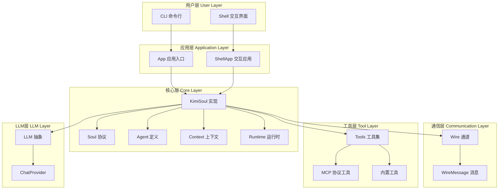
```mermaid
graph TB
    subgraph "用户层 User Layer"
        CLI[CLI 命令行]
        Shell[Shell 交互界面]
    end
    
    subgraph "应用层 Application Layer"
        App[App 应用入口]
        ShellApp[ShellApp 交互应用]
    end
    
    subgraph "核心层 Core Layer"
        Soul[Soul 协议]
        KimiSoul[KimiSoul 实现]
        Agent[Agent 定义]
        Context[Context 上下文]
        Runtime[Runtime 运行时]
    end
    
    subgraph "通信层 Communication Layer"
        Wire[Wire 通道]
        WireMessage[WireMessage 消息]
    end
    
    subgraph "工具层 Tool Layer"
        Tools[Tools 工具集]
        MCP[MCP 协议工具]
        Builtin[内置工具]
    end
    
    subgraph "LLM层 LLM Layer"
        LLM[LLM 抽象]
        ChatProvider[ChatProvider]
    end
    
    CLI --> App
    Shell --> ShellApp
    App --> KimiSoul
    ShellApp --> KimiSoul
    KimiSoul --> Soul
    KimiSoul --> Agent
    KimiSoul --> Context
    KimiSoul --> Runtime
    KimiSoul --> Wire
    Wire --> WireMessage
    KimiSoul --> Tools
    Tools --> MCP
    Tools --> Builtin
    KimiSoul --> LLM
    LLM --> ChatProvider
```

### 2.2 核心概念

| 概念 | 说明 |
|------|------|
| **Soul** | AI Agent 的核心协议接口，定义了 `run()` 方法 |
| **KimiSoul** | Soul 的具体实现，包含完整的对话循环逻辑 |
| **Agent** | Agent 的配置和能力定义，包括 System Prompt 和工具集 |
| **Context** | 对话上下文管理，支持持久化和检查点 |
| **Runtime** | 运行时环境，包含配置、Session、审批等 |
| **Wire** | Soul 与 UI 之间的异步通信管道 |
| **Tool** | AI 可调用的工具，如文件操作、Shell 执行等 |

---

## 3. 核心模块详解

### 3.1 CLI 入口层

#### 3.1.1 入口点定义

CLI 入口在 `pyproject.toml` 中定义：

```toml
[project.scripts]
kimi = "kimi_cli.cli:cli"
```

#### 3.1.2 cli.py 核心逻辑

```python
# src/kimi_cli/cli.py 关键代码片段

@typer_app.command()
def cli(
    command: Annotated[str | None, typer.Argument(help="...")] = None,
    agent: Annotated[str, typer.Option("--agent", "-a", help="...")] = "default",
    yolo: Annotated[bool, typer.Option("--yolo", "-y", help="...")] = False,
    continue_session: Annotated[bool, typer.Option("--continue", "-c")] = False,
    daemon: Annotated[bool, typer.Option("--daemon", "-d")] = False,
    # ... 更多参数
):
    """Kimi CLI 主入口"""
    asyncio.run(_main(
        command=command,
        agent=agent,
        yolo=yolo,
        continue_session=continue_session,
        daemon=daemon,
        # ...
    ))
```

#### 3.1.3 命令行参数流程

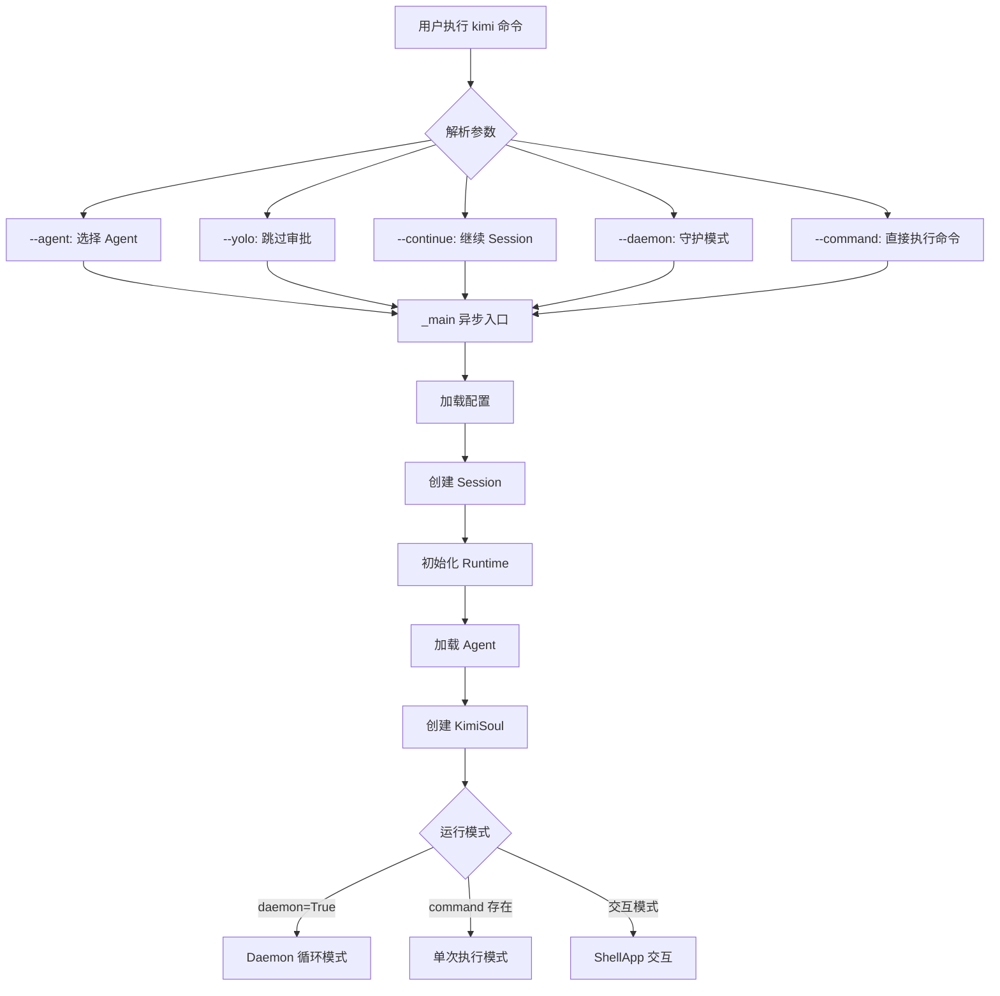
```mermaid
flowchart TD
    A[用户执行 kimi 命令] --> B{解析参数}
    B --> C[--agent: 选择 Agent]
    B --> D[--yolo: 跳过审批]
    B --> E[--continue: 继续 Session]
    B --> F[--daemon: 守护模式]
    B --> G[--command: 直接执行命令]
    
    C & D & E & F & G --> H[_main 异步入口]
    H --> I[加载配置]
    I --> J[创建 Session]
    J --> K[初始化 Runtime]
    K --> L[加载 Agent]
    L --> M[创建 KimiSoul]
    M --> N{运行模式}
    
    N -->|daemon=True| O[Daemon 循环模式]
    N -->|command 存在| P[单次执行模式]
    N -->|交互模式| Q[ShellApp 交互]
```

### 3.2 Soul 核心引擎

#### 3.2.1 Soul 协议定义

```python
# src/kimi_cli/soul/__init__.py

@runtime_checkable
class Soul(Protocol):
    @property
    def name(self) -> str:
        """Soul 的名称"""
        ...

    @property
    def model_name(self) -> str:
        """使用的 LLM 模型名称"""
        ...

    @property
    def status(self) -> StatusSnapshot:
        """当前状态快照"""
        ...

    async def run(self, user_input: str | list[ContentPart]):
        """
        执行 Agent 循环，直到达到最大步数或无更多工具调用
        
        Raises:
            LLMNotSet: LLM 未配置
            LLMNotSupported: LLM 不支持所需能力
            ChatProviderError: LLM 提供商错误
            MaxStepsReached: 达到最大步数
            asyncio.CancelledError: 用户取消
        """
        ...
```

#### 3.2.2 KimiSoul 实现

KimiSoul 是 Soul 协议的核心实现，位于 `src/kimi_cli/soul/kimisoul.py`：

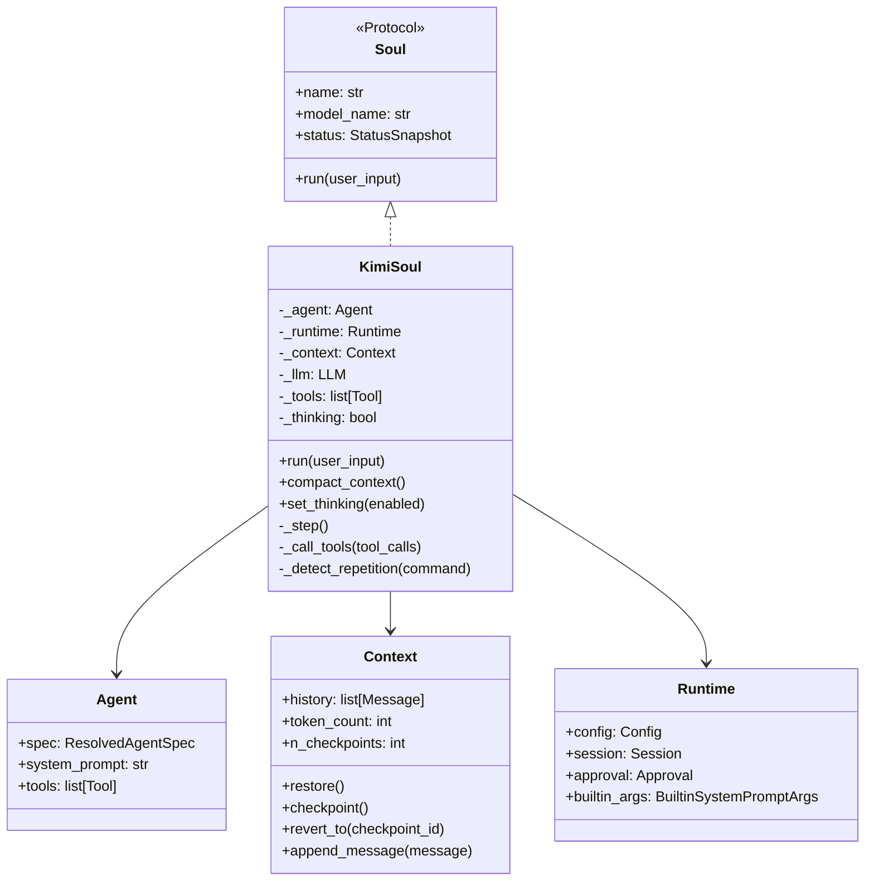
```mermaid
classDiagram
    class Soul {
        <<Protocol>>
        +name: str
        +model_name: str
        +status: StatusSnapshot
        +run(user_input)
    }
    
    class KimiSoul {
        -_agent: Agent
        -_runtime: Runtime
        -_context: Context
        -_llm: LLM
        -_tools: list[Tool]
        -_thinking: bool
        +run(user_input)
        +compact_context()
        +set_thinking(enabled)
        -_step()
        -_call_tools(tool_calls)
        -_detect_repetition(command)
    }
    
    class Agent {
        +spec: ResolvedAgentSpec
        +system_prompt: str
        +tools: list[Tool]
    }
    
    class Context {
        +history: list[Message]
        +token_count: int
        +n_checkpoints: int
        +restore()
        +checkpoint()
        +revert_to(checkpoint_id)
        +append_message(message)
    }
    
    class Runtime {
        +config: Config
        +session: Session
        +approval: Approval
        +builtin_args: BuiltinSystemPromptArgs
    }
    
    Soul <|.. KimiSoul
    KimiSoul --> Agent
    KimiSoul --> Context
    KimiSoul --> Runtime
```

#### 3.2.3 对话循环核心逻辑

```python
# src/kimi_cli/soul/kimisoul.py 核心逻辑

async def run(self, user_input: str | list[ContentPart]):
    """主运行循环"""
    # 1. 添加用户消息到上下文
    user_message = Message(role="user", content=user_input)
    await self._context.append_message(user_message)
    
    # 2. 执行步骤循环
    for step in range(self._max_steps):
        wire_send(StepBegin(n=step))
        
        try:
            has_tool_calls = await self._step()
            if not has_tool_calls:
                break  # 无工具调用，结束循环
        except asyncio.CancelledError:
            wire_send(StepInterrupted())
            raise
    else:
        raise MaxStepsReached(self._max_steps)

async def _step(self) -> bool:
    """执行单个步骤"""
    # 1. 调用 LLM 生成响应
    result = await generate(
        chat_provider=self._llm.chat_provider,
        system_prompt=self._agent.system_prompt,
        tools=self._tools,
        history=list(self._context.history),
    )
    
    # 2. 处理响应内容
    for part in result.message.content:
        wire_send(part)  # 发送到 UI
    
    # 3. 保存 Assistant 消息
    await self._context.append_message(result.message)
    
    # 4. 执行工具调用
    if result.tool_calls:
        await self._call_tools(result.tool_calls)
        return True
    
    return False
```

#### 3.2.4 步骤执行流程

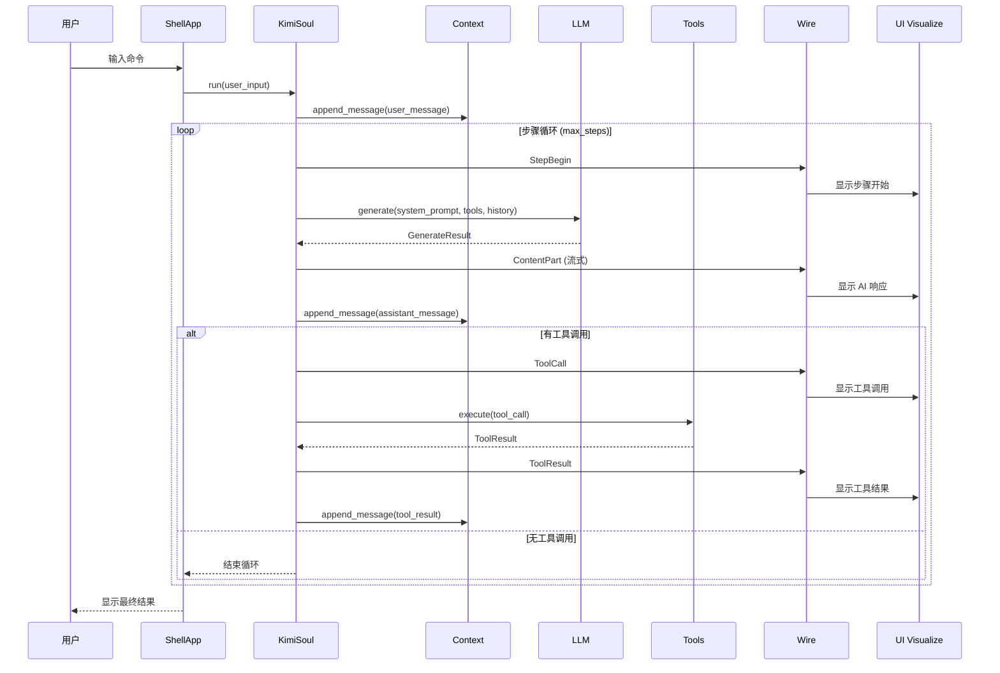
```mermaid
sequenceDiagram
    participant User as 用户
    participant Shell as ShellApp
    participant Soul as KimiSoul
    participant Context as Context
    participant LLM as LLM
    participant Tools as Tools
    participant Wire as Wire
    participant UI as UI Visualize

    User->>Shell: 输入命令
    Shell->>Soul: run(user_input)
    Soul->>Context: append_message(user_message)
    
    loop 步骤循环 (max_steps)
        Soul->>Wire: StepBegin
        Wire->>UI: 显示步骤开始
        
        Soul->>LLM: generate(system_prompt, tools, history)
        LLM-->>Soul: GenerateResult
        
        Soul->>Wire: ContentPart (流式)
        Wire->>UI: 显示 AI 响应
        
        Soul->>Context: append_message(assistant_message)
        
        alt 有工具调用
            Soul->>Wire: ToolCall
            Wire->>UI: 显示工具调用
            
            Soul->>Tools: execute(tool_call)
            Tools-->>Soul: ToolResult
            
            Soul->>Wire: ToolResult
            Wire->>UI: 显示工具结果
            
            Soul->>Context: append_message(tool_result)
        else 无工具调用
            Soul-->>Shell: 结束循环
        end
    end
    
    Shell-->>User: 显示最终结果
```

### 3.3 Wire 通信机制

#### 3.3.1 Wire 架构

Wire 是 Soul 与 UI 之间的异步通信管道，实现了生产者-消费者模式：

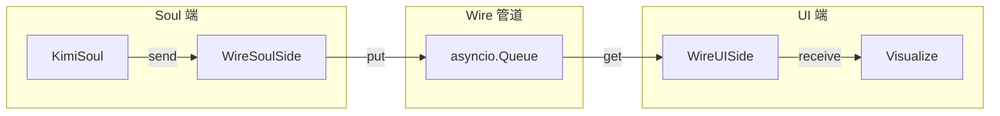
```mermaid
graph LR
    subgraph "Soul 端"
        Soul[KimiSoul]
        SoulSide[WireSoulSide]
    end
    
    subgraph "Wire 管道"
        Queue[asyncio.Queue]
    end
    
    subgraph "UI 端"
        UISide[WireUISide]
        UI[Visualize]
    end
    
    Soul -->|send| SoulSide
    SoulSide -->|put| Queue
    Queue -->|get| UISide
    UISide -->|receive| UI
```

#### 3.3.2 Wire 消息类型

```python
# src/kimi_cli/wire/message.py

# 控制流事件
class StepBegin(NamedTuple):
    n: int  # 步骤编号

class StepInterrupted:
    """步骤被中断"""
    pass

class CompactionBegin:
    """上下文压缩开始"""
    pass

class CompactionEnd:
    """上下文压缩结束"""
    pass

class StatusUpdate(NamedTuple):
    status: StatusSnapshot

# 内容事件
type Event = (
    ControlFlowEvent |      # 控制流
    ContentPart |           # 文本/思考内容
    ToolCall |              # 工具调用
    ToolCallPart |          # 工具调用片段（流式）
    ToolResult |            # 工具结果
    SubagentEvent           # 子 Agent 事件
)

# 审批请求
class ApprovalRequest:
    id: str
    tool_call_id: str
    sender: str
    action: str
    description: str
```

#### 3.3.3 Wire 使用示例

```python
# Soul 端发送消息
from kimi_cli.soul import wire_send
from kimi_cli.wire.message import StepBegin, StatusUpdate

wire_send(StepBegin(n=0))
wire_send(StatusUpdate(status=self.status))

# UI 端接收消息
async def visualize_loop(wire: WireUISide):
    while True:
        msg = await wire.receive()
        match msg:
            case StepBegin(n=step_num):
                print(f"步骤 {step_num} 开始")
            case ContentPart():
                print(f"内容: {msg}")
            case ToolCall():
                print(f"工具调用: {msg.function.name}")
```

### 3.4 Agent 系统

#### 3.4.1 Agent 规范定义

```python
# src/kimi_cli/agentspec.py

@dataclass
class AgentSpec:
    """Agent 规范（原始配置）"""
    name: str
    version: str
    extend: str | None           # 继承的父 Agent
    system_prompt: str           # System Prompt 文件路径
    tools: list[str]             # 工具列表
    mcp: str | None              # MCP 配置文件路径
    mcp_exclude: list[str]       # 排除的 MCP 工具
    subagents: dict[str, str]    # 子 Agent 映射
    vars: dict[str, str]         # 自定义变量

@dataclass
class ResolvedAgentSpec:
    """解析后的 Agent 规范"""
    name: str
    version: str
    system_prompt_path: Path
    tools: list[str]
    mcp_config_path: Path | None
    mcp_exclude: list[str]
    subagents: dict[str, SubagentSpec]
    vars: dict[str, str]
```

#### 3.4.2 Agent 加载流程

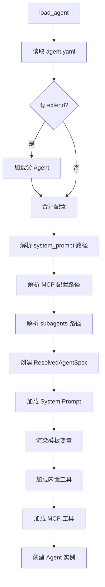
```mermaid
flowchart TD
    A[load_agent] --> B[读取 agent.yaml]
    B --> C{有 extend?}
    
    C -->|是| D[加载父 Agent]
    D --> E[合并配置]
    C -->|否| E
    
    E --> F[解析 system_prompt 路径]
    F --> G[解析 MCP 配置路径]
    G --> H[解析 subagents 路径]
    
    H --> I[创建 ResolvedAgentSpec]
    I --> J[加载 System Prompt]
    J --> K[渲染模板变量]
    K --> L[加载内置工具]
    L --> M[加载 MCP 工具]
    M --> N[创建 Agent 实例]
```

#### 3.4.3 Agent 配置示例

```yaml
# agent.yaml 示例
name: security
version: "0.1"
system_prompt: system.md
tools:
  - ReadFile
  - WriteFile
  - Bash
  - SearchWeb
  - FetchURL
  - Grep
  - Glob
  - LS
  - Think
mcp: mcp.yaml
mcp_exclude:
  - some_tool_to_exclude
subagents:
  coder:
    path: ../default
    description: "编码专家"
vars:
  CUSTOM_VAR: "自定义值"
```

#### 3.4.4 System Prompt 模板变量

```python
# src/kimi_cli/soul/runtime.py

@dataclass
class BuiltinSystemPromptArgs:
    """内置 System Prompt 模板变量"""
    KIMI_NOW: str           # 当前时间
    KIMI_WORK_DIR: Path     # 工作目录
    KIMI_PLATFORM: str      # 操作系统平台
    KIMI_SHELL: str         # Shell 类型
    KIMI_USER: str          # 用户名
    KIMI_AGENTS_MD: str     # AGENTS.md 内容
```

### 3.5 工具系统

#### 3.5.1 工具架构

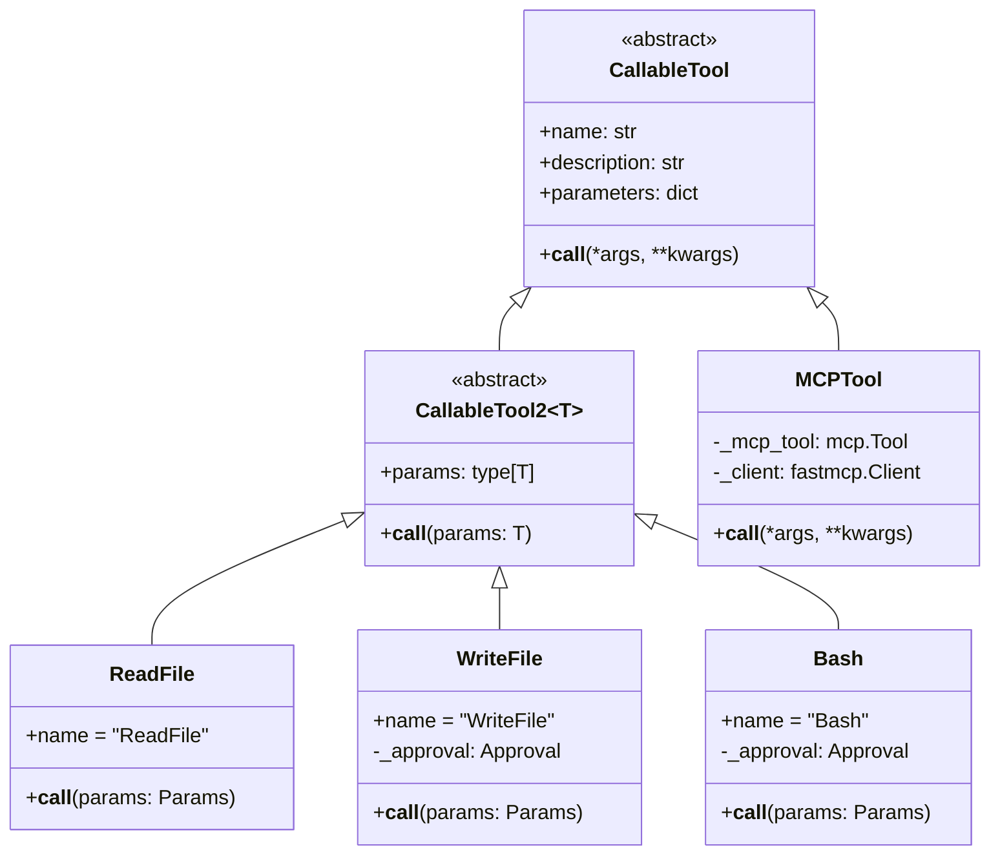
```mermaid
classDiagram
    class CallableTool {
        <<abstract>>
        +name: str
        +description: str
        +parameters: dict
        +__call__(*args, **kwargs)
    }
    
    class CallableTool2~T~ {
        <<abstract>>
        +params: type[T]
        +__call__(params: T)
    }
    
    class ReadFile {
        +name = "ReadFile"
        +__call__(params: Params)
    }
    
    class WriteFile {
        +name = "WriteFile"
        -_approval: Approval
        +__call__(params: Params)
    }
    
    class Bash {
        +name = "Bash"
        -_approval: Approval
        +__call__(params: Params)
    }
    
    class MCPTool {
        -_mcp_tool: mcp.Tool
        -_client: fastmcp.Client
        +__call__(*args, **kwargs)
    }
    
    CallableTool <|-- CallableTool2
    CallableTool2 <|-- ReadFile
    CallableTool2 <|-- WriteFile
    CallableTool2 <|-- Bash
    CallableTool <|-- MCPTool
```

#### 3.5.2 内置工具列表

| 工具名 | 模块 | 功能 | 需要审批 |
|--------|------|------|----------|
| `ReadFile` | `tools/file/read.py` | 读取文件内容 | 否 |
| `WriteFile` | `tools/file/write.py` | 写入文件 | 是 |
| `EditFile` | `tools/file/edit.py` | 编辑文件 | 是 |
| `Bash` / `CMD` | `tools/bash/` | 执行 Shell 命令 | 是 |
| `Grep` | `tools/file/grep.py` | 搜索文件内容 | 否 |
| `Glob` | `tools/file/glob.py` | 文件模式匹配 | 否 |
| `LS` | `tools/file/ls.py` | 列出目录内容 | 否 |
| `SearchWeb` | `tools/web/search.py` | 网络搜索 | 否 |
| `FetchURL` | `tools/web/fetch.py` | 获取网页内容 | 否 |
| `Think` | `tools/think/` | 深度思考 | 否 |
| `Todo` | `tools/todo/` | TODO 管理 | 否 |
| `Task` | `tools/task/` | 子 Agent 任务 | 否 |
| `SendDMail` | `tools/dmail/` | 时间回溯 | 否 |

#### 3.5.3 工具实现示例

```python
# src/kimi_cli/tools/file/read.py

class Params(BaseModel):
    path: str = Field(description="文件绝对路径")
    line_offset: int = Field(default=1, ge=1)
    n_lines: int = Field(default=1000, ge=1)

class ReadFile(CallableTool2[Params]):
    name: str = "ReadFile"
    description: str = load_desc(Path(__file__).parent / "read.md", {...})
    params: type[Params] = Params

    def __init__(self, builtin_args: BuiltinSystemPromptArgs, **kwargs):
        super().__init__(**kwargs)
        self._work_dir = builtin_args.KIMI_WORK_DIR

    async def __call__(self, params: Params) -> ToolReturnType:
        p = Path(params.path)
        
        # 路径验证
        if not p.is_absolute():
            return ToolError(message="必须提供绝对路径", brief="Invalid path")
        if not p.exists():
            return ToolError(message=f"{params.path} 不存在", brief="File not found")
        
        # 读取文件
        lines = []
        async with aiofiles.open(p, encoding="utf-8") as f:
            async for line in f:
                lines.append(line)
                if len(lines) >= params.n_lines:
                    break
        
        return ToolOk(output="".join(lines), message=f"读取了 {len(lines)} 行")
```

#### 3.5.4 工具依赖注入

工具通过构造函数注入依赖：

```python
# src/kimi_cli/tools/__init__.py

def load_builtin_tools(
    tool_names: list[str],
    *,
    runtime: Runtime,
    agent_spec: ResolvedAgentSpec,
) -> list[CallableTool]:
    """加载内置工具"""
    tools = []
    for name in tool_names:
        tool_class = _BUILTIN_TOOLS.get(name)
        if tool_class is None:
            raise ValueError(f"Unknown tool: {name}")
        
        # 依赖注入
        tool = tool_class(
            builtin_args=runtime.builtin_args,
            approval=runtime.approval,
            config=runtime.config,
            # ... 其他依赖
        )
        tools.append(tool)
    return tools
```

### 3.6 UI 交互层

#### 3.6.1 ShellApp 架构

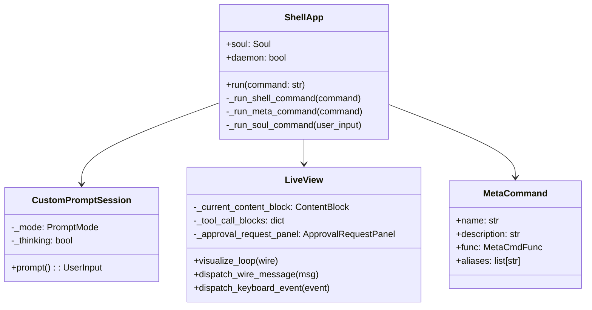
```mermaid
classDiagram
    class ShellApp {
        +soul: Soul
        +daemon: bool
        +run(command: str)
        -_run_shell_command(command)
        -_run_meta_command(command)
        -_run_soul_command(user_input)
    }
    
    class CustomPromptSession {
        -_mode: PromptMode
        -_thinking: bool
        +prompt(): UserInput
    }
    
    class LiveView {
        -_current_content_block: ContentBlock
        -_tool_call_blocks: dict
        -_approval_request_panel: ApprovalRequestPanel
        +visualize_loop(wire)
        +dispatch_wire_message(msg)
        +dispatch_keyboard_event(event)
    }
    
    class MetaCommand {
        +name: str
        +description: str
        +func: MetaCmdFunc
        +aliases: list[str]
    }
    
    ShellApp --> CustomPromptSession
    ShellApp --> LiveView
    ShellApp --> MetaCommand
```

#### 3.6.2 交互流程

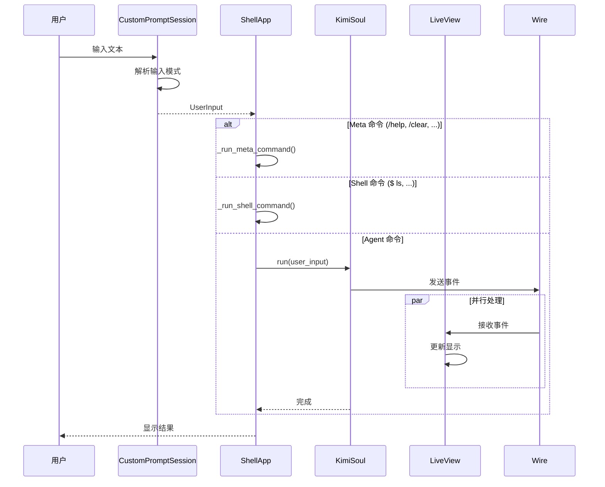
```mermaid
sequenceDiagram
    participant User as 用户
    participant Prompt as CustomPromptSession
    participant Shell as ShellApp
    participant Soul as KimiSoul
    participant Live as LiveView
    participant Wire as Wire

    User->>Prompt: 输入文本
    Prompt->>Prompt: 解析输入模式
    Prompt-->>Shell: UserInput
    
    alt Meta 命令 (/help, /clear, ...)
        Shell->>Shell: _run_meta_command()
    else Shell 命令 ($ ls, ...)
        Shell->>Shell: _run_shell_command()
    else Agent 命令
        Shell->>Soul: run(user_input)
        Soul->>Wire: 发送事件
        
        par 并行处理
            Wire->>Live: 接收事件
            Live->>Live: 更新显示
        end
        
        Soul-->>Shell: 完成
    end
    
    Shell-->>User: 显示结果
```

#### 3.6.3 可视化组件

```python
# src/kimi_cli/ui/shell/visualize.py

class _ContentBlock:
    """文本/思考内容块"""
    def __init__(self, is_think: bool):
        self.is_think = is_think
        self.raw_text = ""
    
    def compose(self) -> RenderableType:
        return Markdown(self.raw_text, style="grey50 italic" if self.is_think else "")

class _ToolCallBlock:
    """工具调用块"""
    def __init__(self, tool_call: ToolCall):
        self._tool_name = tool_call.function.name
        self._result: ToolReturnType | None = None
    
    def compose(self) -> RenderableType:
        status = "✓" if isinstance(self._result, ToolOk) else "✗"
        return Text(f"{status} {self._tool_name}")

class _ApprovalRequestPanel:
    """审批请求面板"""
    def __init__(self, request: ApprovalRequest):
        self.request = request
        self.options = [
            ("Approve", ApprovalResponse.APPROVE),
            ("Approve for session", ApprovalResponse.APPROVE_FOR_SESSION),
            ("Reject", ApprovalResponse.REJECT),
        ]
```

### 3.7 LLM 抽象层

#### 3.7.1 LLM 架构

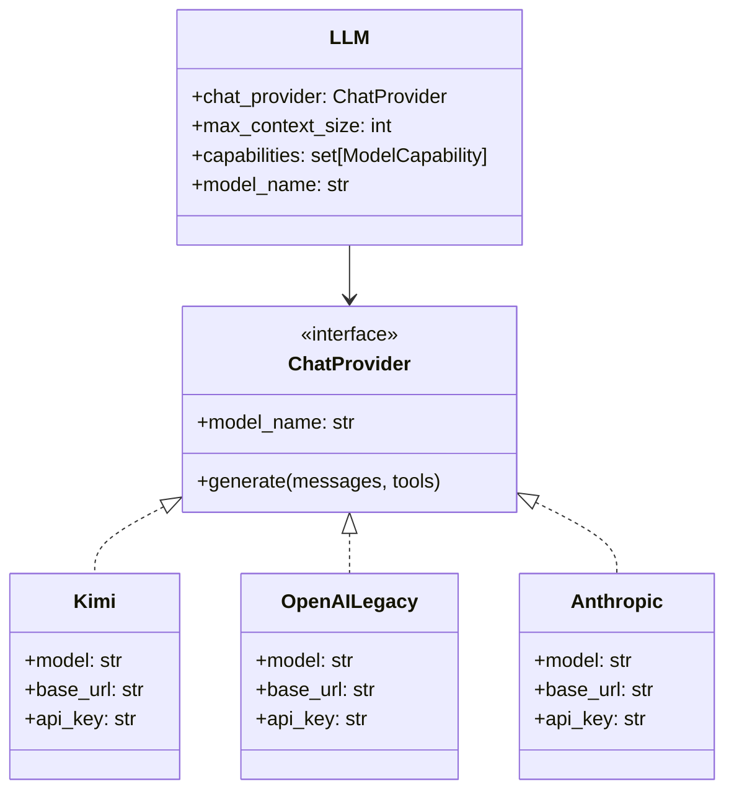
```mermaid
classDiagram
    class LLM {
        +chat_provider: ChatProvider
        +max_context_size: int
        +capabilities: set[ModelCapability]
        +model_name: str
    }
    
    class ChatProvider {
        <<interface>>
        +model_name: str
        +generate(messages, tools)
    }
    
    class Kimi {
        +model: str
        +base_url: str
        +api_key: str
    }
    
    class OpenAILegacy {
        +model: str
        +base_url: str
        +api_key: str
    }
    
    class Anthropic {
        +model: str
        +base_url: str
        +api_key: str
    }
    
    LLM --> ChatProvider
    ChatProvider <|.. Kimi
    ChatProvider <|.. OpenAILegacy
    ChatProvider <|.. Anthropic
```

#### 3.7.2 LLM 创建流程

```python
# src/kimi_cli/llm.py

def create_llm(
    provider: LLMProvider,
    model: LLMModel,
    *,
    stream: bool = True,
    session_id: str | None = None,
) -> LLM:
    """创建 LLM 实例"""
    match provider.type:
        case "kimi":
            from kosong.chat_provider.kimi import Kimi
            chat_provider = Kimi(
                model=model.model,
                base_url=provider.base_url,
                api_key=provider.api_key.get_secret_value(),
                stream=stream,
            )
        case "openai_legacy":
            from kosong.contrib.chat_provider.openai_legacy import OpenAILegacy
            chat_provider = OpenAILegacy(...)
        case "anthropic":
            from kosong.contrib.chat_provider.anthropic import Anthropic
            chat_provider = Anthropic(...)
    
    return LLM(
        chat_provider=chat_provider,
        max_context_size=model.max_context_size,
        capabilities=_derive_capabilities(provider, model),
    )
```

#### 3.7.3 模型能力

```python
type ModelCapability = Literal["image_in", "thinking"]

# 能力说明:
# - image_in: 支持图片输入
# - thinking: 支持深度思考模式
```

---

## 4. 数据流分析

### 4.1 完整请求流程

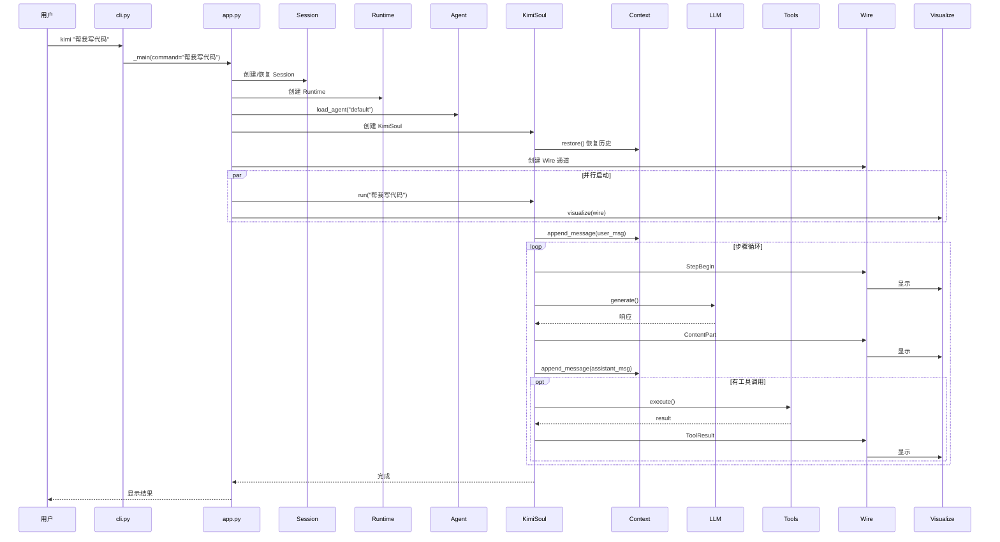
```mermaid
sequenceDiagram
    participant User as 用户
    participant CLI as cli.py
    participant App as app.py
    participant Session as Session
    participant Runtime as Runtime
    participant Agent as Agent
    participant Soul as KimiSoul
    participant Context as Context
    participant LLM as LLM
    participant Tools as Tools
    participant Wire as Wire
    participant UI as Visualize

    User->>CLI: kimi "帮我写代码"
    CLI->>App: _main(command="帮我写代码")
    
    App->>Session: 创建/恢复 Session
    App->>Runtime: 创建 Runtime
    App->>Agent: load_agent("default")
    App->>Soul: 创建 KimiSoul
    
    Soul->>Context: restore() 恢复历史
    
    App->>Wire: 创建 Wire 通道
    
    par 并行启动
        App->>Soul: run("帮我写代码")
        App->>UI: visualize(wire)
    end
    
    Soul->>Context: append_message(user_msg)
    
    loop 步骤循环
        Soul->>Wire: StepBegin
        Wire->>UI: 显示
        
        Soul->>LLM: generate()
        LLM-->>Soul: 响应
        
        Soul->>Wire: ContentPart
        Wire->>UI: 显示
        
        Soul->>Context: append_message(assistant_msg)
        
        opt 有工具调用
            Soul->>Tools: execute()
            Tools-->>Soul: result
            Soul->>Wire: ToolResult
            Wire->>UI: 显示
        end
    end
    
    Soul-->>App: 完成
    App-->>User: 显示结果
```

### 4.2 上下文管理流程

#### 4.2.1 Context 类核心结构

`Context` 类位于 `src/kimi_cli/soul/context.py`，负责管理对话历史的持久化存储：

```python
# src/kimi_cli/soul/context.py 核心结构

class Context:
    def __init__(self, file_backend: Path):
        self._file_backend = file_backend      # history.jsonl 文件路径
        self._history: list[Message] = []      # 内存中的消息历史
        self._token_count: int = 0             # 当前 token 计数
        self._next_checkpoint_id: int = 0      # 下一个检查点 ID
```

#### 4.2.2 上下文写入流程

上下文写入通过 `Context.append_message()` 方法实现，同时写入内存和文件：

```python
# src/kimi_cli/soul/context.py

async def append_message(self, message: Message | Sequence[Message]):
    """追加消息到上下文"""
    messages = message if isinstance(message, Sequence) else [message]
    
    # 1. 写入内存
    self._history.extend(messages)
    
    # 2. 写入文件（追加模式）
    async with aiofiles.open(self._file_backend, "a", encoding="utf-8") as f:
        for message in messages:
            await f.write(message.model_dump_json(exclude_none=True) + "\n")
```

**history.jsonl 文件格式**：

```jsonl
{"role": "user", "content": "帮我写一个 Python 脚本"}
{"role": "assistant", "content": "好的，我来帮你写..."}
{"role": "_usage", "token_count": 1500}
{"role": "_checkpoint", "id": 0}
{"role": "tool", "content": "文件已创建", "tool_call_id": "call_xxx"}
```

特殊记录类型：
- `_usage`: 记录 token 使用量
- `_checkpoint`: 检查点标记，用于回滚

#### 4.2.3 KimiSoul 中的上下文写入时机

在 `KimiSoul._step()` 和 `KimiSoul._grow_context()` 中触发写入：

```python
# src/kimi_cli/soul/kimisoul.py

async def run(self, user_input: str | list[ContentPart]):
    """主运行入口"""
    # 1. 创建检查点（首次运行创建 checkpoint 0）
    await self._checkpoint()
    
    # 2. 写入用户消息
    await self._context.append_message(Message(role="user", content=user_input))
    
    # 3. 进入 Agent 循环
    await self._agent_loop()

async def _grow_context(self, result: StepResult, tool_results: list[ToolResult], ...):
    """扩展上下文（写入 LLM 响应和工具结果）"""
    # 1. 写入 Assistant 消息
    await self._context.append_message(result.message)
    
    # 2. 更新 token 计数
    if result.usage is not None:
        await self._context.update_token_count(result.usage.total)
    
    # 3. 写入工具结果
    for tool_result in tool_results:
        await self._context.append_message(tool_result_to_messages(tool_result))
```

#### 4.2.4 上下文写入时序图

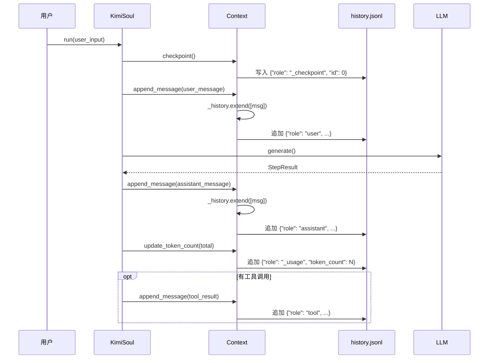
```mermaid
sequenceDiagram
    participant User as 用户
    participant Soul as KimiSoul
    participant Context as Context
    participant File as history.jsonl
    participant LLM as LLM

    User->>Soul: run(user_input)
    Soul->>Context: checkpoint()
    Context->>File: 写入 {"role": "_checkpoint", "id": 0}
    
    Soul->>Context: append_message(user_message)
    Context->>Context: _history.extend([msg])
    Context->>File: 追加 {"role": "user", ...}
    
    Soul->>LLM: generate()
    LLM-->>Soul: StepResult
    
    Soul->>Context: append_message(assistant_message)
    Context->>Context: _history.extend([msg])
    Context->>File: 追加 {"role": "assistant", ...}
    
    Soul->>Context: update_token_count(total)
    Context->>File: 追加 {"role": "_usage", "token_count": N}
    
    opt 有工具调用
        Soul->>Context: append_message(tool_result)
        Context->>File: 追加 {"role": "tool", ...}
    end
```

#### 4.2.5 上下文压缩机制

**触发条件**：在 `KimiSoul._agent_loop()` 中，每个步骤开始前检查：

```python
# src/kimi_cli/soul/kimisoul.py

RESERVED_TOKENS = 50_000  # 预留 token 数

async def _agent_loop(self):
    while True:
        # 检查是否需要压缩
        if (self._context.token_count + self._reserved_tokens 
            >= self._runtime.llm.max_context_size):
            logger.info("Context too long, compacting...")
            wire_send(CompactionBegin())
            await self.compact_context()
            wire_send(CompactionEnd())
        
        # 继续执行步骤...
```

**压缩算法** (`SimpleCompaction`)：

```python
# src/kimi_cli/soul/compaction.py

class SimpleCompaction(Compaction):
    MAX_PRESERVED_MESSAGES = 2  # 保留最近 2 条 user/assistant 消息

    async def compact(self, messages: Sequence[Message], llm: LLM) -> Sequence[Message]:
        history = list(messages)
        
        # 1. 找到需要保留的最近消息
        preserve_start_index = len(history)
        n_preserved = 0
        for index in range(len(history) - 1, -1, -1):
            if history[index].role in {"user", "assistant"}:
                n_preserved += 1
                if n_preserved == self.MAX_PRESERVED_MESSAGES:
                    preserve_start_index = index
                    break
        
        # 2. 分离：待压缩部分 + 保留部分
        to_compact = history[:preserve_start_index]
        to_preserve = history[preserve_start_index:]
        
        # 3. 调用 LLM 生成摘要
        history_text = "\n\n".join(
            f"## Message {i + 1}\nRole: {msg.role}\nContent: {msg.content}"
            for i, msg in enumerate(to_compact)
        )
        compact_prompt = Template(prompts.COMPACT).substitute(CONTEXT=history_text)
        
        result = await generate(
            chat_provider=llm.chat_provider,
            system_prompt="You are a helpful assistant that compacts conversation context.",
            tools=[],
            history=[Message(role="user", content=compact_prompt)],
        )
        
        # 4. 构建压缩后的消息序列
        compacted_messages = [
            Message(role="assistant", content=[
                system("Previous context has been compacted..."),
                TextPart(text=result.message.content)
            ])
        ]
        compacted_messages.extend(to_preserve)
        return compacted_messages
```

**压缩执行流程**：

```python
# src/kimi_cli/soul/kimisoul.py

async def compact_context(self) -> None:
    """执行上下文压缩"""
    # 1. 调用压缩算法生成压缩后的消息
    compacted_messages = await self._compaction.compact(
        self._context.history, self._runtime.llm
    )
    
    # 2. 回滚到检查点 0（清空历史）
    await self._context.revert_to(0)
    
    # 3. 创建新检查点
    await self._checkpoint()
    
    # 4. 写入压缩后的消息
    await self._context.append_message(compacted_messages)
```

#### 4.2.6 压缩流程图

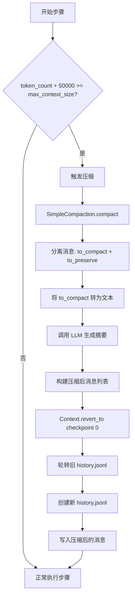
```mermaid
flowchart TD
    A[开始步骤] --> B{token_count + 50000 >= max_context_size?}
    B -->|否| C[正常执行步骤]
    B -->|是| D[触发压缩]
    
    D --> E[SimpleCompaction.compact]
    E --> F[分离消息: to_compact + to_preserve]
    F --> G[将 to_compact 转为文本]
    G --> H[调用 LLM 生成摘要]
    H --> I[构建压缩后消息列表]
    
    I --> J[Context.revert_to checkpoint 0]
    J --> K[轮转旧 history.jsonl]
    K --> L[创建新 history.jsonl]
    L --> M[写入压缩后的消息]
    
    M --> C
```

#### 4.2.7 检查点与回滚机制

**检查点创建**：

```python
# src/kimi_cli/soul/context.py

async def checkpoint(self, add_user_message: bool):
    """创建检查点"""
    checkpoint_id = self._next_checkpoint_id
    self._next_checkpoint_id += 1
    
    # 写入检查点标记
    async with aiofiles.open(self._file_backend, "a", encoding="utf-8") as f:
        await f.write(json.dumps({"role": "_checkpoint", "id": checkpoint_id}) + "\n")
    
    # 可选：添加用户可见的检查点消息（用于 D-Mail 功能）
    if add_user_message:
        await self.append_message(
            Message(role="user", content=[system(f"CHECKPOINT {checkpoint_id}")])
        )
```

**回滚到检查点**：

```python
# src/kimi_cli/soul/context.py

async def revert_to(self, checkpoint_id: int):
    """回滚到指定检查点"""
    # 1. 轮转旧文件 (history.jsonl -> history.jsonl.1)
    rotated_file_path = await next_available_rotation(self._file_backend)
    await aiofiles.os.rename(self._file_backend, rotated_file_path)
    
    # 2. 清空内存状态
    self._history.clear()
    self._token_count = 0
    self._next_checkpoint_id = 0
    
    # 3. 从旧文件恢复到指定检查点
    async with (
        aiofiles.open(rotated_file_path, encoding="utf-8") as old_file,
        aiofiles.open(self._file_backend, "w", encoding="utf-8") as new_file,
    ):
        async for line in old_file:
            line_json = json.loads(line)
            
            # 遇到目标检查点则停止
            if line_json["role"] == "_checkpoint" and line_json["id"] == checkpoint_id:
                break
            
            # 写入新文件并恢复内存状态
            await new_file.write(line)
            if line_json["role"] == "_usage":
                self._token_count = line_json["token_count"]
            elif line_json["role"] == "_checkpoint":
                self._next_checkpoint_id = line_json["id"] + 1
            else:
                self._history.append(Message.model_validate(line_json))
```

#### 4.2.8 Session 与 Context 的关系

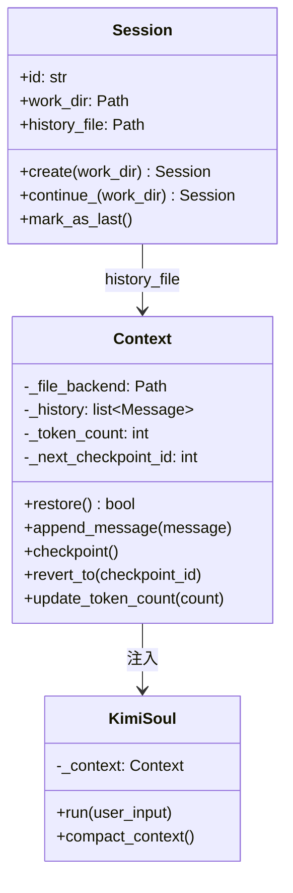
```mermaid
classDiagram
    class Session {
        +id: str
        +work_dir: Path
        +history_file: Path
        +create(work_dir) Session
        +continue_(work_dir) Session
        +mark_as_last()
    }
    
    class Context {
        -_file_backend: Path
        -_history: list~Message~
        -_token_count: int
        -_next_checkpoint_id: int
        +restore() bool
        +append_message(message)
        +checkpoint()
        +revert_to(checkpoint_id)
        +update_token_count(count)
    }
    
    class KimiSoul {
        -_context: Context
        +run(user_input)
        +compact_context()
    }
    
    Session --> Context : history_file
    Context --> KimiSoul : 注入
```

**创建流程**：

```python
# src/kimi_cli/app.py

async def create(...):
    # 1. 创建或恢复 Session
    session = Session.create(work_dir)  # 或 Session.continue_(work_dir)
    
    # 2. 使用 Session 的 history_file 创建 Context
    context = Context(session.history_file)
    
    # 3. 恢复历史（如果存在）
    await context.restore()
    
    # 4. 注入到 KimiSoul
    soul = KimiSoul(agent, runtime, context=context)
```

#### 4.2.9 上下文管理总览图

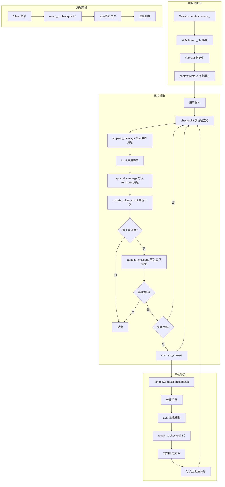
```mermaid
flowchart TD
    subgraph "初始化阶段"
        A1[Session.create/continue_] --> A2[获取 history_file 路径]
        A2 --> A3[Context 初始化]
        A3 --> A4[context.restore 恢复历史]
    end
    
    subgraph "运行阶段"
        B1[用户输入] --> B2[checkpoint 创建检查点]
        B2 --> B3[append_message 写入用户消息]
        B3 --> B4[LLM 生成响应]
        B4 --> B5[append_message 写入 Assistant 消息]
        B5 --> B6[update_token_count 更新计数]
        B6 --> B7{有工具调用?}
        B7 -->|是| B8[append_message 写入工具结果]
        B8 --> B9{继续循环?}
        B7 -->|否| B10[结束]
        B9 -->|是| B11{需要压缩?}
        B11 -->|是| B12[compact_context]
        B11 -->|否| B2
        B12 --> B2
        B9 -->|否| B10
    end
    
    subgraph "压缩阶段"
        C1[SimpleCompaction.compact] --> C2[分离消息]
        C2 --> C3[LLM 生成摘要]
        C3 --> C4[revert_to checkpoint 0]
        C4 --> C5[轮转历史文件]
        C5 --> C6[写入压缩后消息]
    end
    
    subgraph "清理阶段"
        D1["/clear 命令"] --> D2[revert_to checkpoint 0]
        D2 --> D3[轮转历史文件]
        D3 --> D4[重新加载]
    end
    
    A4 --> B1
    B12 --> C1
    C6 --> B2
```

#### 4.2.10 压缩后的回滚限制

**重要说明**：压缩成功后，**无法自动回滚到未压缩的上下文**。

**原因分析**：

```python
# src/kimi_cli/soul/kimisoul.py
async def compact_context(self) -> None:
    compacted_messages = await self._compaction.compact(...)
    
    # 关键：回滚到 checkpoint 0，触发文件轮转
    await self._context.revert_to(0)
    
    await self._checkpoint()
    await self._context.append_message(compacted_messages)
```

```python
# src/kimi_cli/soul/context.py
async def revert_to(self, checkpoint_id: int):
    # 旧文件被轮转为 history.jsonl.1, .2, .3...
    rotated_file_path = await next_available_rotation(self._file_backend)
    await aiofiles.os.rename(self._file_backend, rotated_file_path)
    
    # 内存状态被清空
    self._history.clear()
    self._token_count = 0
    self._next_checkpoint_id = 0
```

**压缩与轮转流程**：

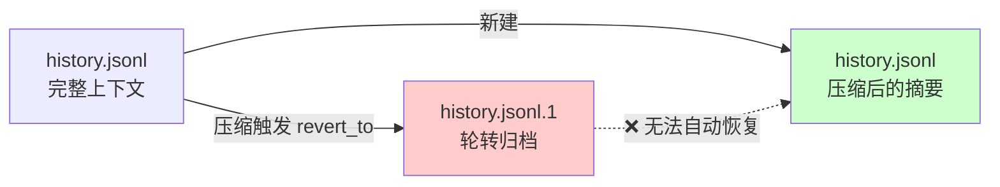
```mermaid
flowchart LR
    A[history.jsonl<br/>完整上下文] -->|压缩触发 revert_to| B[history.jsonl.1<br/>轮转归档]
    A -->|新建| C[history.jsonl<br/>压缩后的摘要]
    
    B -.->|❌ 无法自动恢复| C
    
    style B fill:#ffcccc
    style C fill:#ccffcc
```

**状态说明**：

| 状态 | 说明 |
|------|------|
| **轮转文件保留** | 旧的完整上下文被保存为 `history.jsonl.1`、`.2` 等 |
| **无自动恢复机制** | 代码中没有从轮转文件恢复的功能 |
| **手动恢复可行** | 理论上可手动将 `.1` 文件重命名回 `history.jsonl` |

#### 4.2.11 压缩超时与重试机制

**问题**：如果压缩时请求 LLM 超时，是否会长时间阻塞？

**答案**：**不会无限阻塞**。压缩阶段有完善的重试和异常处理机制。

**重试机制实现**：

```python
# src/kimi_cli/soul/kimisoul.py

async def compact_context(self) -> None:
    @tenacity.retry(
        retry=retry_if_exception(self._is_retryable_error),  # 判断是否可重试
        before_sleep=partial(self._retry_log, "compaction"),  # 重试前记录日志
        wait=wait_exponential_jitter(initial=0.3, max=10, jitter=0.5),  # 指数退避
        stop=stop_after_attempt(self._loop_control.max_retries_per_step),  # 最大重试次数
        reraise=True,  # 超过次数后抛出原始异常
    )
    async def _compact_with_retry() -> Sequence[Message]:
        return await self._compaction.compact(self._context.history, self._runtime.llm)
    
    compacted_messages = await _compact_with_retry()
    # ...
```

**可重试错误类型**：

```python
# src/kimi_cli/soul/kimisoul.py

@staticmethod
def _is_retryable_error(exception: BaseException) -> bool:
    # 连接错误、超时、空响应 -> 重试
    if isinstance(exception, (APIConnectionError, APITimeoutError, APIEmptyResponseError)):
        return True
    # HTTP 状态码判断
    if isinstance(exception, APIStatusError):
        return exception.status_code in (
            408,  # Request Timeout
            429,  # Too Many Requests (限流)
            500,  # Internal Server Error
            502,  # Bad Gateway
            503,  # Service Unavailable
            504,  # Gateway Timeout
        )
    # httpx/httpcore 网络错误
    if isinstance(exception, (httpx.HTTPError, httpcore.ReadError)):
        return True
    return False
```

**重试策略参数**：

| 参数 | 值 | 说明 |
|------|-----|------|
| `initial` | 0.3s | 首次重试等待时间 |
| `max` | 10s | 最大等待时间 |
| `jitter` | 0.5 | 随机抖动系数 |
| `max_retries_per_step` | 3 | 最大重试次数（可配置） |

**异常处理流程**：

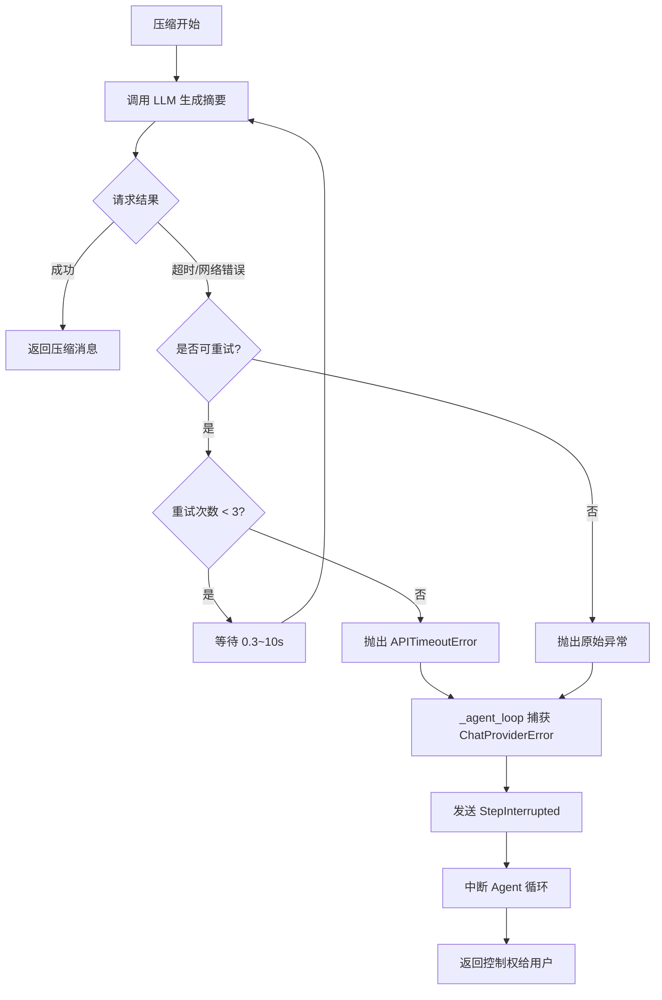
```mermaid
flowchart TD
    A[压缩开始] --> B[调用 LLM 生成摘要]
    B --> C{请求结果}
    
    C -->|成功| D[返回压缩消息]
    C -->|超时/网络错误| E{是否可重试?}
    
    E -->|是| F{重试次数 < 3?}
    F -->|是| G[等待 0.3~10s]
    G --> B
    F -->|否| H[抛出 APITimeoutError]
    
    E -->|否| I[抛出原始异常]
    
    H --> J[_agent_loop 捕获 ChatProviderError]
    I --> J
    J --> K[发送 StepInterrupted]
    K --> L[中断 Agent 循环]
    L --> M[返回控制权给用户]
```

**Agent 循环中的异常捕获**：

```python
# src/kimi_cli/soul/kimisoul.py

async def _agent_loop(self):
    while True:
        try:
            # 压缩（可能超时）
            if need_compaction:
                await self.compact_context()
            
            # 执行步骤
            finished = await self._step()
        except (ChatProviderError, asyncio.CancelledError):
            wire_send(StepInterrupted())  # 通知 UI 步骤被中断
            raise  # 中断循环，返回控制权
```

**实际行为总结**：

| 场景 | 行为 |
|------|------|
| 首次超时 | 等待 ~0.3s 后重试 |
| 第二次超时 | 等待 ~0.6s 后重试 |
| 第三次超时 | 等待 ~1.2s 后重试 |
| 第四次超时 | 抛出异常，中断任务，返回交互式 Shell |

**最坏情况耗时**：约 `0.3 + 0.6 + 1.2 + 请求超时时间 × 4` ≈ 数十秒到几分钟（取决于 LLM 提供商的超时设置）。

**扩展建议**：如果需要从轮转文件恢复，可扩展 `Context` 类：

```python
async def restore_from_rotation(self, rotation_index: int = 1):
    """从轮转文件恢复（需自行实现）"""
    rotated_file = self._file_backend.with_suffix(f".jsonl.{rotation_index}")
    if rotated_file.exists():
        # 备份当前文件
        current_backup = await next_available_rotation(self._file_backend)
        await aiofiles.os.rename(self._file_backend, current_backup)
        # 恢复轮转文件
        await aiofiles.os.rename(rotated_file, self._file_backend)
        # 重新加载
        self._history.clear()
        self._token_count = 0
        self._next_checkpoint_id = 0
        await self.restore()
```

**使用场景**：

- 压缩后发现摘要丢失了关键信息
- 需要回溯完整的对话历史进行调试
- 压缩算法出现问题导致上下文损坏

### 4.2.12 上下文压缩全链路源码分析

本节提供压缩上下文机制的完整源码级分析，涵盖从触发条件到最终写入的全部流程。

#### 一、整体架构概览

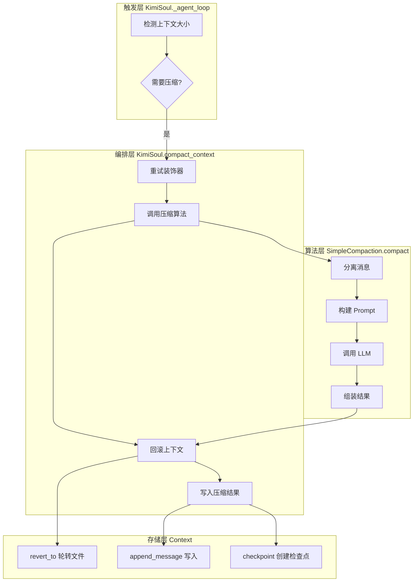
```mermaid
flowchart TB
    subgraph "触发层 KimiSoul._agent_loop"
        A[检测上下文大小] --> B{需要压缩?}
    end
    
    subgraph "编排层 KimiSoul.compact_context"
        C[重试装饰器] --> D[调用压缩算法]
        D --> E[回滚上下文]
        E --> F[写入压缩结果]
    end
    
    subgraph "算法层 SimpleCompaction.compact"
        G[分离消息] --> H[构建 Prompt]
        H --> I[调用 LLM]
        I --> J[组装结果]
    end
    
    subgraph "存储层 Context"
        K[revert_to 轮转文件]
        L[append_message 写入]
        M[checkpoint 创建检查点]
    end
    
    B -->|是| C
    D --> G
    J --> E
    E --> K
    F --> M
    F --> L
```

#### 二、核心类与职责

| 类/模块 | 文件位置 | 职责 |
|---------|----------|------|
| `KimiSoul` | `soul/kimisoul.py` | 压缩触发、重试编排、异常处理 |
| `SimpleCompaction` | `soul/compaction.py` | 压缩算法实现（LLM 摘要） |
| `Context` | `soul/context.py` | 历史存储、文件轮转、检查点管理 |
| `LoopControl` | `config.py` | 配置参数（重试次数等） |

#### 三、阶段一：触发检测

**位置**：`src/kimi_cli/soul/kimisoul.py` → `_agent_loop()`

```python
RESERVED_TOKENS = 50_000  # 预留 token 数，确保有空间执行下一步

async def _agent_loop(self):
    """Agent 主循环"""
    step_no = 1
    while True:
        wire_send(StepBegin(step_no))
        try:
            # ========== 压缩触发检测 ==========
            if (
                self._context.token_count + self._reserved_tokens
                >= self._runtime.llm.max_context_size
            ):
                logger.info("Context too long, compacting...")
                wire_send(CompactionBegin())      # 通知 UI 压缩开始
                await self.compact_context()       # 执行压缩
                wire_send(CompactionEnd())         # 通知 UI 压缩结束
            
            # 继续执行步骤...
            finished = await self._step()
        except (ChatProviderError, asyncio.CancelledError):
            wire_send(StepInterrupted())
            raise  # 压缩失败会走到这里
```

**触发条件公式**：

```
当前 token 数 + 50,000 >= 模型最大上下文
```

**示例**：假设使用 Claude 3.5 Sonnet（200K context）
- 当 `token_count >= 150,000` 时触发压缩
- 预留 50K 确保压缩后还能执行至少一个步骤

#### 四、阶段二：重试编排

**位置**：`src/kimi_cli/soul/kimisoul.py` → `compact_context()`

```python
async def compact_context(self) -> None:
    """
    压缩上下文的入口方法。
    
    Raises:
        LLMNotSet: 未配置 LLM
        ChatProviderError: LLM 调用失败（重试耗尽后）
    """
    
    # ========== 重试装饰器配置 ==========
    @tenacity.retry(
        retry=retry_if_exception(self._is_retryable_error),  # 判断是否重试
        before_sleep=partial(self._retry_log, "compaction"), # 重试前记录日志
        wait=wait_exponential_jitter(                        # 指数退避策略
            initial=0.3,   # 首次等待 0.3s
            max=10,        # 最大等待 10s
            jitter=0.5     # 随机抖动 ±50%
        ),
        stop=stop_after_attempt(                             # 最大重试次数
            self._loop_control.max_retries_per_step          # 默认 3 次
        ),
        reraise=True,  # 超过次数后抛出原始异常
    )
    async def _compact_with_retry() -> Sequence[Message]:
        if self._runtime.llm is None:
            raise LLMNotSet()
        # 调用压缩算法
        return await self._compaction.compact(
            self._context.history,  # 当前所有消息
            self._runtime.llm       # LLM 配置
        )
    
    # ========== 执行压缩 ==========
    compacted_messages = await _compact_with_retry()
    
    # ========== 重置上下文 ==========
    await self._context.revert_to(0)      # 回滚到 checkpoint 0（清空）
    await self._checkpoint()               # 创建新的 checkpoint 0
    await self._context.append_message(compacted_messages)  # 写入压缩结果
```

**可重试错误判断**：

```python
@staticmethod
def _is_retryable_error(exception: BaseException) -> bool:
    # 网络/超时/空响应 -> 重试
    if isinstance(exception, (
        APIConnectionError,   # 连接失败
        APITimeoutError,      # 请求超时
        APIEmptyResponseError # 空响应
    )):
        return True
    
    # HTTP 状态码判断
    if isinstance(exception, APIStatusError):
        return exception.status_code in (
            408,  # Request Timeout
            429,  # Too Many Requests (限流)
            500,  # Internal Server Error
            502,  # Bad Gateway
            503,  # Service Unavailable
            504,  # Gateway Timeout
            520, 521, 522, 523, 524, 525, 526, 527  # Cloudflare 错误
        )
    
    # httpx/httpcore 底层网络错误
    if isinstance(exception, (httpx.HTTPError, httpcore.ReadError)):
        return True
    
    return False  # 其他错误不重试（如认证失败、参数错误）
```

**重试时序**：

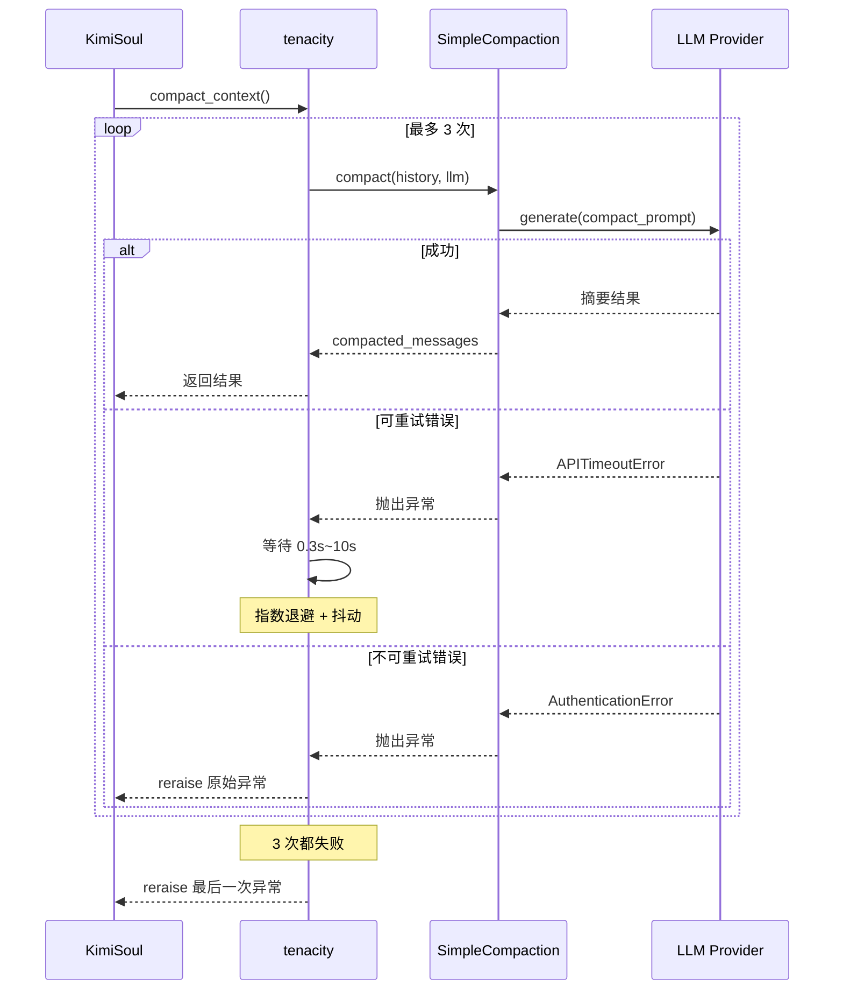
```mermaid
sequenceDiagram
    participant Soul as KimiSoul
    participant Retry as tenacity
    participant Algo as SimpleCompaction
    participant LLM as LLM Provider
    
    Soul->>Retry: compact_context()
    
    loop 最多 3 次
        Retry->>Algo: compact(history, llm)
        Algo->>LLM: generate(compact_prompt)
        
        alt 成功
            LLM-->>Algo: 摘要结果
            Algo-->>Retry: compacted_messages
            Retry-->>Soul: 返回结果
        else 可重试错误
            LLM-->>Algo: APITimeoutError
            Algo-->>Retry: 抛出异常
            Retry->>Retry: 等待 0.3s~10s
            Note over Retry: 指数退避 + 抖动
        else 不可重试错误
            LLM-->>Algo: AuthenticationError
            Algo-->>Retry: 抛出异常
            Retry-->>Soul: reraise 原始异常
        end
    end
    
    Note over Retry: 3 次都失败
    Retry-->>Soul: reraise 最后一次异常
```

#### 五、阶段三：压缩算法

**位置**：`src/kimi_cli/soul/compaction.py` → `SimpleCompaction`

```python
class SimpleCompaction(Compaction):
    MAX_PRESERVED_MESSAGES = 2  # 保留最近 2 条 user/assistant 消息
    
    async def compact(
        self, 
        messages: Sequence[Message], 
        llm: LLM
    ) -> Sequence[Message]:
        history = list(messages)
        if not history:
            return history
        
        # ========== Step 1: 找到保留边界 ==========
        # 从后往前找，保留最近 2 条 user/assistant 消息
        preserve_start_index = len(history)
        n_preserved = 0
        for index in range(len(history) - 1, -1, -1):
            if history[index].role in {"user", "assistant"}:
                n_preserved += 1
                if n_preserved == self.MAX_PRESERVED_MESSAGES:
                    preserve_start_index = index
                    break
        
        # 如果消息太少，不压缩
        if n_preserved < self.MAX_PRESERVED_MESSAGES:
            return history
        
        # ========== Step 2: 分离消息 ==========
        to_compact = history[:preserve_start_index]   # 待压缩部分
        to_preserve = history[preserve_start_index:]  # 保留部分
        
        if not to_compact:
            return to_preserve
        
        # ========== Step 3: 构建压缩 Prompt ==========
        # 将待压缩消息转为文本
        history_text = "\n\n".join(
            f"## Message {i + 1}\nRole: {msg.role}\nContent: {msg.content}"
            for i, msg in enumerate(to_compact)
        )
        
        # 使用模板生成 Prompt
        compact_template = Template(prompts.COMPACT)
        compact_prompt = compact_template.substitute(CONTEXT=history_text)
        
        # ========== Step 4: 调用 LLM 生成摘要 ==========
        logger.debug("Compacting context...")
        result = await generate(
            chat_provider=llm.chat_provider,
            system_prompt="You are a helpful assistant that compacts conversation context.",
            tools=[],  # 压缩时不需要工具
            history=[Message(role="user", content=compact_prompt)],
        )
        
        if result.usage:
            logger.debug(
                "Compaction used {input} input tokens and {output} output tokens",
                input=result.usage.input,
                output=result.usage.output,
            )
        
        # ========== Step 5: 组装压缩结果 ==========
        content: list[ContentPart] = [
            system("Previous context has been compacted. Here is the compaction output:")
        ]
        compacted_msg = result.message
        content.extend(
            [TextPart(text=compacted_msg.content)]
            if isinstance(compacted_msg.content, str)
            else compacted_msg.content
        )
        
        # 压缩摘要 + 保留的最近消息
        compacted_messages: list[Message] = [
            Message(role="assistant", content=content)
        ]
        compacted_messages.extend(to_preserve)
        return compacted_messages
```

**消息分离示意图**：

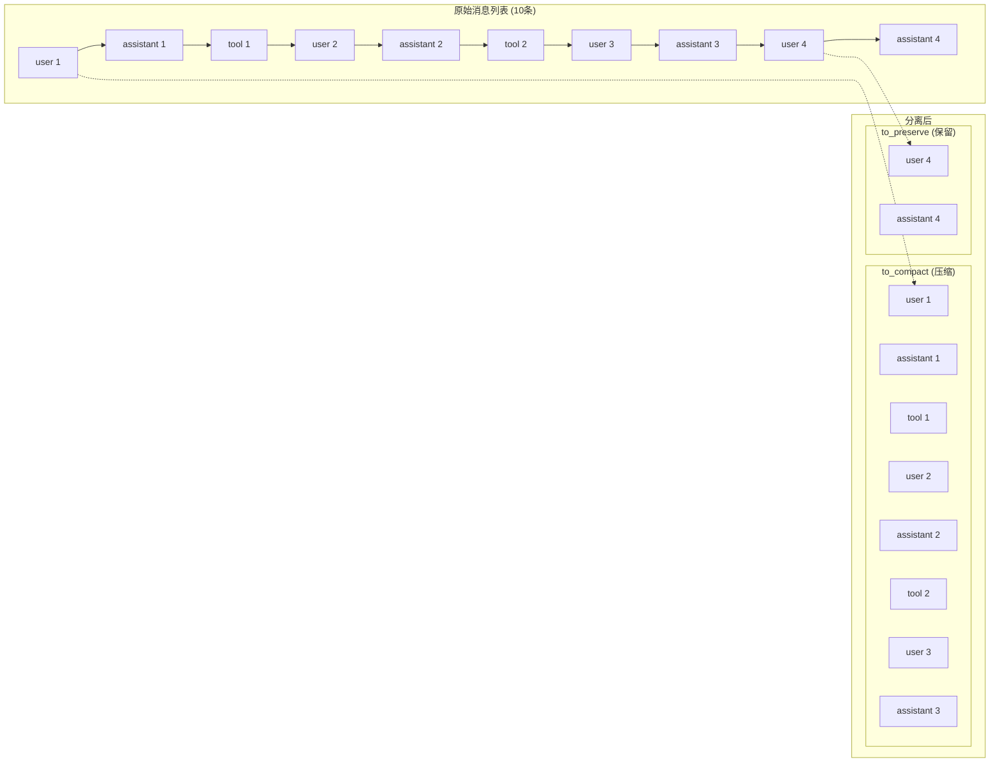
```mermaid
flowchart LR
    subgraph "原始消息列表 (10条)"
        M1[user 1] --> M2[assistant 1]
        M2 --> M3[tool 1]
        M3 --> M4[user 2]
        M4 --> M5[assistant 2]
        M5 --> M6[tool 2]
        M6 --> M7[user 3]
        M7 --> M8[assistant 3]
        M8 --> M9[user 4]
        M9 --> M10[assistant 4]
    end
    
    subgraph "分离后"
        direction TB
        subgraph "to_compact (压缩)"
            C1[user 1]
            C2[assistant 1]
            C3[tool 1]
            C4[user 2]
            C5[assistant 2]
            C6[tool 2]
            C7[user 3]
            C8[assistant 3]
        end
        subgraph "to_preserve (保留)"
            P1[user 4]
            P2[assistant 4]
        end
    end
    
    M1 -.-> C1
    M9 -.-> P1
```

**压缩 Prompt 模板** (`src/kimi_cli/prompts/compact.md`)：

```markdown
You are tasked with compacting a coding conversation context.

**Compression Priorities (in order):**
1. **Current Task State**: What is being worked on RIGHT NOW
2. **Errors & Solutions**: All encountered errors and their resolutions
3. **Code Evolution**: Final working versions only
4. **System Context**: Project structure, dependencies
5. **Design Decisions**: Architectural choices
6. **TODO Items**: Unfinished tasks

**Required Output Structure:**
<current_focus>[What we're working on now]</current_focus>
<environment>[Key setup/config points]</environment>
<completed_tasks>[Task]: [Brief outcome]</completed_tasks>
<active_issues>[Issue]: [Status/Next steps]</active_issues>
<code_state>[Critical code snippets]</code_state>
<important_context>[Crucial information]</important_context>

**Input Context to Compress:**
${CONTEXT}
```

#### 六、阶段四：存储层操作

**位置**：`src/kimi_cli/soul/context.py`

##### 6.1 文件轮转 (`revert_to`)

```python
async def revert_to(self, checkpoint_id: int):
    """
    回滚到指定检查点，触发文件轮转。
    
    Args:
        checkpoint_id: 目标检查点 ID（压缩时为 0）
    """
    logger.debug("Reverting checkpoint, ID: {id}", id=checkpoint_id)
    
    # 验证检查点存在
    if checkpoint_id >= self._next_checkpoint_id:
        raise ValueError(f"Checkpoint {checkpoint_id} does not exist")
    
    # ========== Step 1: 轮转文件 ==========
    # history.jsonl -> history.jsonl.1 (如果 .1 存在则 -> .2, 以此类推)
    rotated_file_path = await next_available_rotation(self._file_backend)
    if rotated_file_path is None:
        raise RuntimeError("No available rotation path found")
    await aiofiles.os.rename(self._file_backend, rotated_file_path)
    logger.debug("Rotated history file: {path}", path=rotated_file_path)
    
    # ========== Step 2: 清空内存状态 ==========
    self._history.clear()
    self._token_count = 0
    self._next_checkpoint_id = 0
    
    # ========== Step 3: 从旧文件恢复到目标检查点 ==========
    async with (
        aiofiles.open(rotated_file_path, encoding="utf-8") as old_file,
        aiofiles.open(self._file_backend, "w", encoding="utf-8") as new_file,
    ):
        async for line in old_file:
            if not line.strip():
                continue
            
            line_json = json.loads(line)
            
            # 遇到目标检查点则停止
            if line_json["role"] == "_checkpoint" and line_json["id"] == checkpoint_id:
                break
            
            # 写入新文件
            await new_file.write(line)
            
            # 恢复内存状态
            if line_json["role"] == "_usage":
                self._token_count = line_json["token_count"]
            elif line_json["role"] == "_checkpoint":
                self._next_checkpoint_id = line_json["id"] + 1
            else:
                message = Message.model_validate(line_json)
                self._history.append(message)
```

**文件轮转示意图**：

```mermaid
flowchart LR
    subgraph "压缩前"
        A[history.jsonl<br/>150K tokens]
    end
    
    subgraph "revert_to(0) 执行后"
        B[history.jsonl.1<br/>150K tokens<br/>归档保留]
        C[history.jsonl<br/>空文件]
    end
    
    subgraph "写入压缩结果后"
        D[history.jsonl.1<br/>150K tokens]
        E[history.jsonl<br/>~10K tokens<br/>摘要 + 最近2条]
    end
    
    A -->|rename| B
    A -->|create new| C
    C -->|append_message| E
```

##### 6.2 写入消息 (`append_message`)

```python
async def append_message(self, message: Message | Sequence[Message]):
    """追加消息到上下文（内存 + 文件）"""
    messages = message if isinstance(message, Sequence) else [message]
    
    # 写入内存
    self._history.extend(messages)
    
    # 追加到文件
    async with aiofiles.open(self._file_backend, "a", encoding="utf-8") as f:
        for message in messages:
            await f.write(message.model_dump_json(exclude_none=True) + "\n")
```

##### 6.3 创建检查点 (`checkpoint`)

```python
async def checkpoint(self, add_user_message: bool):
    """创建检查点标记"""
    checkpoint_id = self._next_checkpoint_id
    self._next_checkpoint_id += 1
    
    # 写入检查点记录
    async with aiofiles.open(self._file_backend, "a", encoding="utf-8") as f:
        await f.write(json.dumps({
            "role": "_checkpoint", 
            "id": checkpoint_id
        }) + "\n")
    
    # 可选：添加用户可见的检查点消息（D-Mail 功能需要）
    if add_user_message:
        await self.append_message(
            Message(role="user", content=[system(f"CHECKPOINT {checkpoint_id}")])
        )
```

#### 七、完整流程时序图

```mermaid
sequenceDiagram
    participant AgentLoop as _agent_loop
    participant Soul as compact_context
    participant Retry as tenacity
    participant Algo as SimpleCompaction
    participant LLM as LLM Provider
    participant Ctx as Context
    participant File as history.jsonl
    
    Note over AgentLoop: token_count 超过阈值
    AgentLoop->>AgentLoop: wire_send CompactionBegin
    AgentLoop->>Soul: compact_context
    
    Soul->>Retry: _compact_with_retry
    Retry->>Algo: compact history llm
    
    Note over Algo: Step 1 分离消息
    Algo->>Algo: to_compact and to_preserve
    
    Note over Algo: Step 2 构建 Prompt
    Algo->>Algo: history_text and prompt
    
    Note over Algo: Step 3 调用 LLM
    Algo->>LLM: generate prompt
    
    alt 成功
        LLM-->>Algo: 摘要文本
    else 超时或网络错误
        LLM-->>Algo: APITimeoutError
        Algo-->>Retry: raise
        Retry->>Retry: wait 0.3s to 10s
        Retry->>Algo: 重试
    end
    
    Note over Algo: Step 4 组装结果
    Algo->>Algo: compacted messages
    Algo-->>Retry: compacted_messages
    Retry-->>Soul: compacted_messages
    
    Note over Soul: Step 5 重置上下文
    Soul->>Ctx: revert_to 0
    Ctx->>File: rename to history.jsonl.1
    Ctx->>File: create new history.jsonl
    Ctx->>Ctx: clear memory state
    
    Note over Soul: Step 6 写入结果
    Soul->>Ctx: checkpoint
    Ctx->>File: write checkpoint record
    
    Soul->>Ctx: append_message compacted
    Ctx->>Ctx: history extend compacted
    Ctx->>File: write messages as JSONL
    
    Soul-->>AgentLoop: 完成
    AgentLoop->>AgentLoop: wire_send CompactionEnd
```

#### 八、异常处理与边界情况

##### 8.1 异常传播路径

```mermaid
flowchart TD
    A[LLM 调用失败] --> B{错误类型}
    
    B -->|APITimeoutError| C[重试]
    B -->|APIConnectionError| C
    B -->|429 限流| C
    B -->|500/502/503/504| C
    
    B -->|401 认证失败| D[不重试]
    B -->|400 参数错误| D
    B -->|其他| D
    
    C --> E{重试次数}
    E -->|< 3| F[等待后重试]
    F --> A
    E -->|>= 3| G[reraise]
    
    D --> G
    G --> H[ChatProviderError]
    H --> I[_agent_loop 捕获]
    I --> J[wire_send StepInterrupted]
    J --> K[raise 中断循环]
    K --> L[返回交互式 Shell]
```

##### 8.2 当前实现的问题

| 问题 | 说明 | 影响 |
|------|------|------|
| **无保底策略** | 压缩失败后直接中断，不会尝试简单截断 | 任务被迫终止 |
| **无法恢复** | 轮转文件保留但无自动恢复机制 | 需手动恢复 |
| **单一算法** | 只有 `SimpleCompaction`，无法切换 | 灵活性不足 |

##### 8.3 建议的保底策略

```python
class FallbackCompaction:
    """保底压缩：不依赖 LLM，直接截断"""
    KEEP_LAST = 10
    
    async def compact(self, messages: Sequence[Message], llm: LLM) -> Sequence[Message]:
        if len(messages) <= self.KEEP_LAST:
            return messages
        
        truncated = list(messages[-self.KEEP_LAST:])
        warning = Message(
            role="assistant",
            content=[system(
                "[警告] LLM 压缩失败，早期对话历史已被截断。"
                "部分上下文信息可能丢失。"
            )]
        )
        return [warning] + truncated

# 修改 compact_context 添加 fallback
async def compact_context(self) -> None:
    try:
        compacted = await _compact_with_retry()
    except ChatProviderError:
        logger.warning("LLM compaction failed, using fallback truncation")
        compacted = await FallbackCompaction().compact(
            self._context.history, self._runtime.llm
        )
    
    await self._context.revert_to(0)
    await self._checkpoint()
    await self._context.append_message(compacted)
```

#### 九、配置参数参考

| 参数 | 位置 | 默认值 | 说明 |
|------|------|--------|------|
| `RESERVED_TOKENS` | `kimisoul.py` | 50,000 | 预留 token 数 |
| `MAX_PRESERVED_MESSAGES` | `compaction.py` | 2 | 保留最近消息数 |
| `max_retries_per_step` | `config.py` | 3 | 最大重试次数 |
| `initial` (wait) | `kimisoul.py` | 0.3s | 首次重试等待 |
| `max` (wait) | `kimisoul.py` | 10s | 最大等待时间 |
| `jitter` (wait) | `kimisoul.py` | 0.5 | 随机抖动系数 |

#### 十、调试与监控

**日志关键字**：

```bash
# 查看压缩相关日志
kimi --log-level debug 2>&1 | grep -E "(compact|Compact|revert|Rotated)"
```

**关键日志点**：

| 日志 | 位置 | 含义 |
|------|------|------|
| `Context too long, compacting...` | `_agent_loop` | 触发压缩 |
| `Compacting context...` | `SimpleCompaction` | 开始调用 LLM |
| `Compaction used X input tokens` | `SimpleCompaction` | 压缩完成 |
| `Reverting checkpoint, ID: 0` | `Context` | 开始回滚 |
| `Rotated history file: xxx.1` | `Context` | 文件轮转完成 |
| `Retrying compaction for the N time` | `_retry_log` | 重试中 |

### 4.3 审批流程

```mermaid
sequenceDiagram
    participant Tool as 工具
    participant Approval as Approval
    participant Wire as Wire
    participant UI as ApprovalPanel
    participant User as 用户

    Tool->>Approval: request(action, description)
    
    alt YOLO 模式
        Approval-->>Tool: True (自动批准)
    else 已批准的 Action
        Approval-->>Tool: True
    else 需要用户确认
        Approval->>Wire: ApprovalRequest
        Wire->>UI: 显示审批面板
        
        User->>UI: 选择选项
        UI->>Wire: ApprovalResponse
        Wire->>Approval: resolve(response)
        
        alt Approve
            Approval-->>Tool: True
        else Approve for Session
            Approval->>Approval: 记录自动批准
            Approval-->>Tool: True
        else Reject
            Approval-->>Tool: False
        end
    end
```

---

## 5. 扩展开发指南

### 5.1 添加新工具

1. **创建工具目录和文件**：

```bash
mkdir -p src/kimi_cli/tools/mytool
touch src/kimi_cli/tools/mytool/__init__.py
touch src/kimi_cli/tools/mytool/mytool.md
```

2. **实现工具类**：

```python
# src/kimi_cli/tools/mytool/__init__.py

from pathlib import Path
from typing import override
from pydantic import BaseModel, Field
from kosong.tooling import CallableTool2, ToolOk, ToolError, ToolReturnType
from kimi_cli.tools.utils import load_desc

class Params(BaseModel):
    input: str = Field(description="输入参数")

class MyTool(CallableTool2[Params]):
    name: str = "MyTool"
    description: str = load_desc(Path(__file__).parent / "mytool.md")
    params: type[Params] = Params

    @override
    async def __call__(self, params: Params) -> ToolReturnType:
        try:
            result = f"处理结果: {params.input}"
            return ToolOk(output=result, message="成功")
        except Exception as e:
            return ToolError(message=str(e), brief="失败")
```

3. **注册工具**：

```python
# src/kimi_cli/tools/__init__.py

from kimi_cli.tools.mytool import MyTool

_BUILTIN_TOOLS: dict[str, type[CallableTool]] = {
    # ... 其他工具
    "MyTool": MyTool,
}
```

4. **在 Agent 中启用**：

```yaml
# agent.yaml
tools:
  - MyTool
```

### 5.2 添加新 Agent

参考 [CUSTOM_AGENT_GUIDE.md](./CUSTOM_AGENT_GUIDE.md) 获取完整指南。

### 5.3 添加新 Meta 命令

```python
# src/kimi_cli/ui/shell/metacmd.py

@meta_command(aliases=["mc"])
async def mycommand(app: "ShellApp", args: list[str]):
    """我的自定义命令"""
    console.print("执行自定义命令")
    # 可以访问 app.soul 与 AI 交互
```

---

## 6. 调试技巧

### 6.1 启用调试日志

```bash
# 设置环境变量
export KIMI_DEBUG=1
kimi "你的命令"
```

### 6.2 查看上下文历史

```bash
# 历史文件位置
~/.kimi-cli/sessions/<session_id>/history.jsonl
```

### 6.3 调试工具执行

```python
# 在工具中添加日志
from kimi_cli.utils.logging import logger

logger.debug("工具参数: {params}", params=params)
```

### 6.4 常用调试命令

| 命令 | 功能 |
|------|------|
| `/debug` | 显示调试信息 |
| `/clear` | 清除上下文 |
| `/compact` | 压缩上下文 |
| `/help` | 显示帮助 |

### 6.5 测试运行

```bash
# 运行测试
uv run pytest tests/

# 运行特定测试
uv run pytest tests/test_tools.py -v

# 类型检查
uv run pyright src/
```

---

## 附录

### A. 关键类型定义

```python
# 工具返回类型
type ToolReturnType = ToolOk | ToolError

# Wire 消息类型
type WireMessage = Event | ApprovalRequest

# 事件类型
type Event = (
    ControlFlowEvent |
    ContentPart |
    ToolCall |
    ToolCallPart |
    ToolResult |
    SubagentEvent
)

# 模型能力
type ModelCapability = Literal["image_in", "thinking"]
```

### B. 配置文件位置

| 文件 | 位置 | 说明 |
|------|------|------|
| 全局配置 | `~/.kimi-cli/config.yaml` | 用户配置 |
| Session 历史 | `~/.kimi-cli/sessions/` | 会话历史 |
| 用户历史 | `~/.kimi-cli/user-history/` | 输入历史 |

### C. 环境变量

| 变量 | 说明 |
|------|------|
| `KIMI_API_KEY` | Kimi API 密钥 |
| `KIMI_BASE_URL` | Kimi API 地址 |
| `KIMI_MODEL_NAME` | 模型名称 |
| `OPENAI_API_KEY` | OpenAI API 密钥 |
| `OPENAI_BASE_URL` | OpenAI API 地址 |
| `KIMI_DEBUG` | 启用调试模式 |

---

*本文档基于 kimi-cli v0.52 版本编写*
