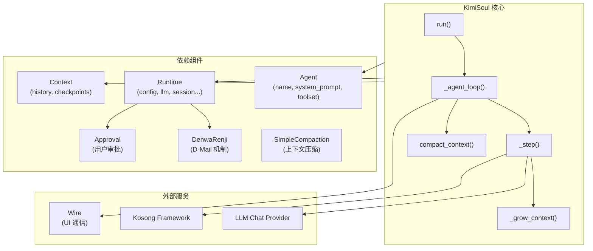
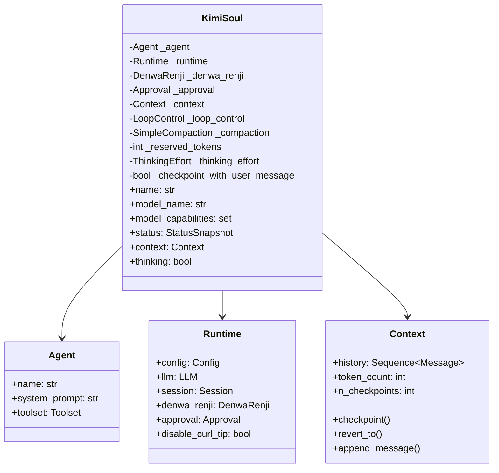
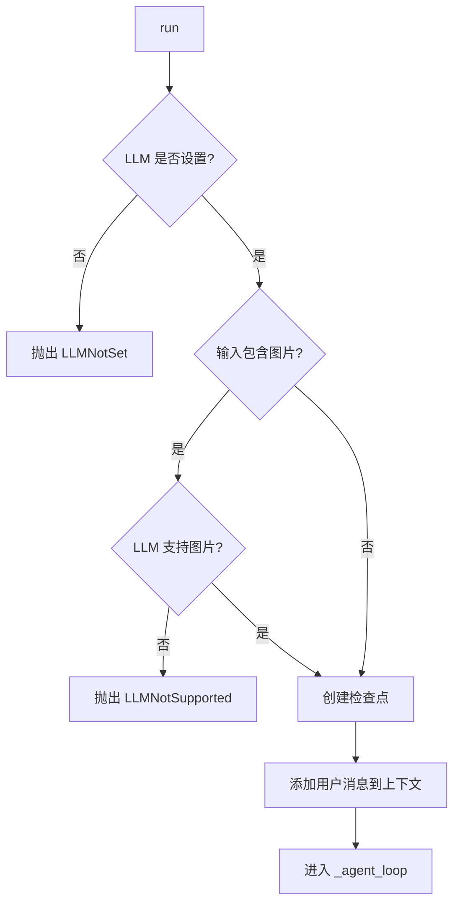
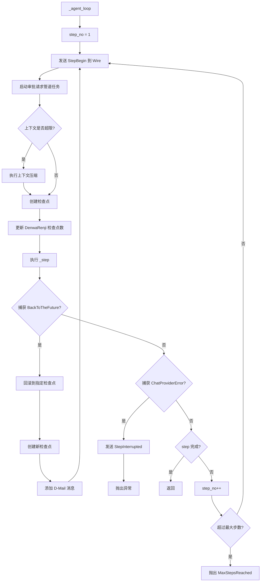
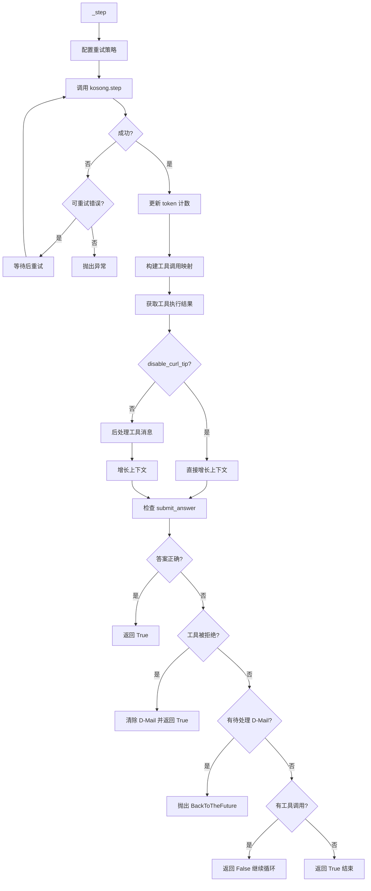
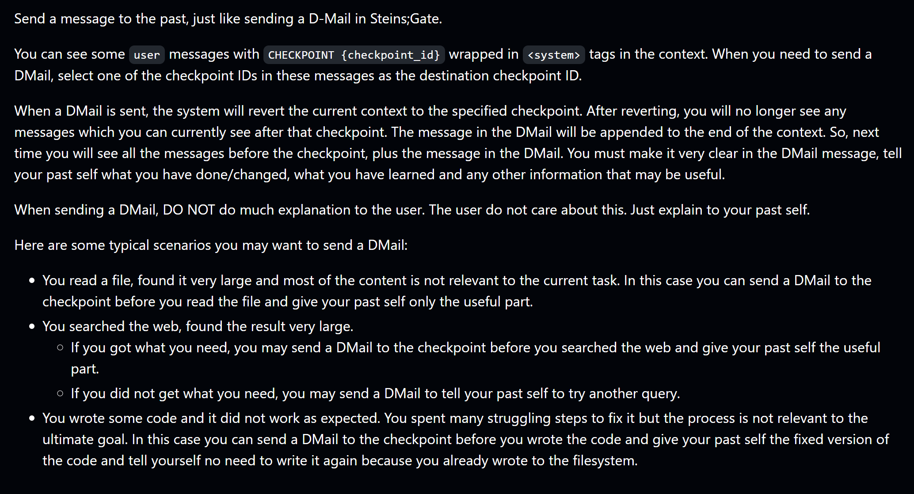
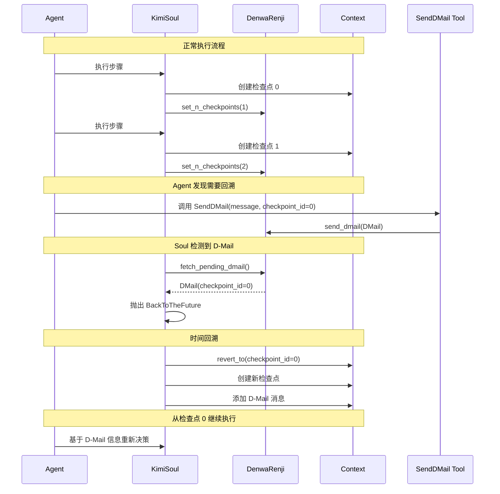
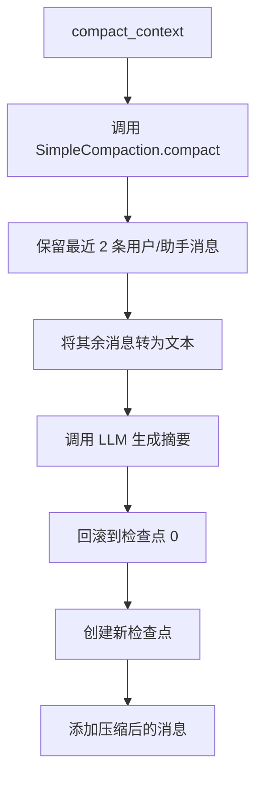
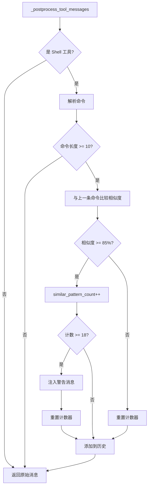
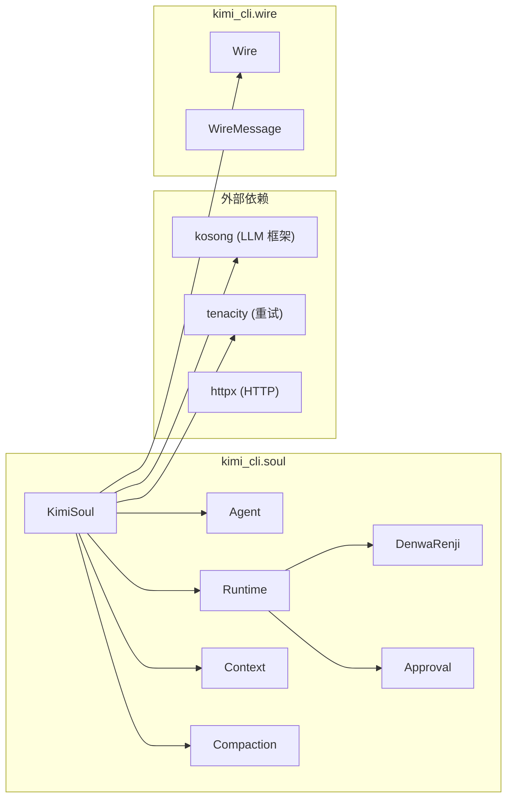

# KimiSoul 核心类分析文档

## 概述

`KimiSoul` 是 Kimi CLI 的核心执行引擎，实现了 `Soul` 协议接口。它负责协调 AI Agent 的运行循环、上下文管理、工具调用、错误重试以及独特的"时间回溯"机制（D-Mail）。

## 架构总览



## 类初始化参数详解

### 构造函数签名

```python
def __init__(
    self,
    agent: Agent,
    runtime: Runtime,
    *,
    context: Context,
)
```

### Python 语法说明：`*` 强制关键字参数分隔符

构造函数中的 `*` 是 Python 的**强制关键字参数分隔符**（keyword-only arguments separator）：

```python
def __init__(
    self,
    agent: Agent,      # 位置参数或关键字参数
    runtime: Runtime,  # 位置参数或关键字参数
    *,                 # 分隔符：之后的参数必须用关键字传递
    context: Context,  # 仅关键字参数（keyword-only）
)
```

**调用方式对比**：

```python
# ✅ 正确：context 使用关键字传递
soul = KimiSoul(agent, runtime, context=context)

# ✅ 正确：全部使用关键字
soul = KimiSoul(agent=agent, runtime=runtime, context=context)

# ❌ 错误：context 不能作为位置参数
soul = KimiSoul(agent, runtime, context)  # TypeError!
```

**设计目的**：
1. **提高可读性**：强制调用者明确写出 `context=`，代码意图更清晰
2. **防止参数顺序错误**：避免位置参数传错位置
3. **API 稳定性**：后续可以在 `*` 后添加新参数而不破坏现有调用

### 参数说明

| 参数 | 类型 | 传递方式 | 说明 |
|------|------|----------|------|
| `agent` | `Agent` | 位置/关键字 | 包含 agent 名称、系统提示词和工具集的配置对象 |
| `runtime` | `Runtime` | 位置/关键字 | 运行时环境，包含 LLM、配置、会话等 |
| `context` | `Context` | **仅关键字** | 上下文管理器，负责消息历史和检查点 |

## 内部属性详解

### 核心属性



### 属性详细说明

| 属性 | 类型 | 作用 |
|------|------|------|
| `_agent` | `Agent` | Agent 配置，包含系统提示词和工具集 |
| `_runtime` | `Runtime` | 运行时环境配置 |
| `_denwa_renji` | `DenwaRenji` | D-Mail 时间回溯机制管理器 |
| `_approval` | `Approval` | 用户审批请求管理器 |
| `_context` | `Context` | 消息历史和检查点管理 |
| `_loop_control` | `LoopControl` | 循环控制参数（最大步数、重试次数等） |
| `_compaction` | `SimpleCompaction` | 上下文压缩策略 |
| `_reserved_tokens` | `int` | 保留的 token 数量（默认 50,000） |
| `_thinking_effort` | `ThinkingEffort` | 思考模式强度（"off"/"high"） |
| `_checkpoint_with_user_message` | `bool` | 是否在检查点添加用户消息标记 |

### 循环检测属性

用于检测 Agent 是否陷入重复命令循环：

| 属性 | 类型 | 作用 |
|------|------|------|
| `_similar_pattern_count` | `int` | 连续相似命令计数器 |
| `_last_commands` | `list[str]` | 最近执行的命令历史（最多 18 条） |
| `_similarity_threshold` | `float` | 相似度阈值（0.85 = 85%） |
| `_min_cmd_length` | `int` | 最小检测命令长度（10 字符） |

## 核心方法流程分析

### 1. run() - 入口方法



**功能**：
- 验证 LLM 是否已配置
- 检查图片输入的模型能力支持
- 创建初始检查点（checkpoint 0）
- 将用户输入添加到上下文
- 启动主循环

### 2. _agent_loop() - 主循环



**核心逻辑**：
1. **循环执行步骤**：每个步骤执行一次 LLM 调用
2. **上下文管理**：自动检测并压缩过长的上下文
3. **D-Mail 处理**：捕获 `BackToTheFuture` 异常实现时间回溯
4. **错误处理**：优雅处理 API 错误和取消事件
5. **步数限制**：防止无限循环

### 3. _step() - 单步执行



#### 工具调用 ID 映射：`id_to_call_info`

在 `_step()` 方法中，有一个关键的数据结构 `id_to_call_info`，用于建立**工具调用 ID 到工具信息的反向映射**：

```python
id_to_call_info: dict[str, tuple[str, str]] = {
    getattr(call, "id"): (
        getattr(getattr(call, "function", None), "name", "") or "",
        getattr(getattr(call, "function", None), "arguments", "") or "",
    )
    for call in (getattr(result, "tool_calls", []) or [])
    if getattr(call, "id", None)
}
```

**映射结构**：
```
tool_call_id  →  (工具名, 参数字符串)
```

**设计背景**：

LLM 返回的 `StepResult` 包含 `tool_calls`（工具调用请求），执行后得到 `tool_results`（工具执行结果）。但 `tool_results` 只包含 `tool_call_id` 和执行结果，**不包含**原始的工具名和参数。因此需要这个映射来反查。

**使用场景**：

| 场景 | 代码位置 | 说明 |
|------|----------|------|
| 后处理工具消息 | `_postprocess_tool_messages()` | 根据工具名/参数对消息做特殊处理（如添加 curl 提示） |
| 检测 `submit_answer` | `_step()` 末尾 | 通过 ID 反查工具名，判断是否是提交答案的工具 |

**防御性编程**：

使用链式 `getattr` 访问是因为 `tool_calls` 可能来自不同 provider，结构不完全一致：

```python
# 安全访问，避免 AttributeError
getattr(getattr(call, "function", None), "name", "") or ""
```

**重试策略**：
- 使用 `tenacity` 库实现指数退避重试
- 初始等待 0.3 秒，最大 10 秒
- 添加随机抖动（jitter）避免雷群效应
- 可重试错误包括：连接错误、超时、空响应、特定 HTTP 状态码

### 4. D-Mail 时间回溯机制


- [d-mail 理解：压缩上下文的方式之一，用于裁剪当前上下文](https://x.com/tunahorse21/status/1983600710353875037)



**D-Mail 机制说明**：
- 灵感来源于《命运石之门》
- 允许 Agent 向"过去的自己"发送消息
- 通过检查点实现上下文状态回滚
- D-Mail 消息以系统消息形式注入，对用户不可见

### 5. 上下文压缩



**压缩策略**：
- 保留最近 2 条关键消息（用户/助手）
- 将历史消息发送给 LLM 生成摘要
- 重置上下文并添加压缩后的内容
- 保留 50,000 tokens 作为缓冲区

### 6. 循环检测机制



**检测参数**：
- 相似度阈值：85%（使用 `SequenceMatcher`）
- 最小命令长度：10 字符
- 触发警告阈值：连续 18 次相似命令
- 历史记录容量：最近 18 条命令

## 属性和方法速查表

### 公开属性

| 属性 | 返回类型 | 说明 |
|------|----------|------|
| `name` | `str` | Agent 名称 |
| `model_name` | `str` | LLM 模型名称 |
| `model_capabilities` | `set[ModelCapability] \| None` | 模型能力集 |
| `status` | `StatusSnapshot` | 当前状态快照（上下文使用率） |
| `context` | `Context` | 上下文管理器 |
| `thinking` | `bool` | 是否启用思考模式 |

### 公开方法

| 方法 | 参数 | 说明 |
|------|------|------|
| `set_thinking(enabled)` | `bool` | 启用/禁用思考模式 |
| `run(user_input)` | `str \| list[ContentPart]` | 运行 Agent |
| `compact_context()` | 无 | 压缩上下文 |

### 私有方法

| 方法 | 说明 |
|------|------|
| `_checkpoint()` | 创建上下文检查点 |
| `_agent_loop()` | 主执行循环 |
| `_step()` | 执行单个 LLM 步骤 |
| `_grow_context()` | 将结果添加到上下文 |
| `_is_similar_to_last_command()` | 检测命令相似度 |
| `_postprocess_tool_messages()` | 后处理工具消息 |
| `_is_retryable_error()` | 判断错误是否可重试 |
| `_retry_log()` | 记录重试日志 |

## 异常类

### BackToTheFuture

```python
class BackToTheFuture(Exception):
    def __init__(self, checkpoint_id: int, messages: Sequence[Message]):
        self.checkpoint_id = checkpoint_id
        self.messages = messages
```

**用途**：触发时间回溯，将上下文回滚到指定检查点并注入新消息。

## 依赖组件关系



## 配置参数

### LoopControl 配置

| 参数 | 说明 | 默认值 |
|------|------|--------|
| `max_steps_per_run` | 每次运行最大步数 | 配置文件定义 |
| `max_retries_per_step` | 每步最大重试次数 | 配置文件定义 |

### 可重试 HTTP 状态码

```python
(408, 404, 429, 500, 502, 503, 504, 520, 521, 522, 523, 524, 525, 526, 527)
```

## 使用示例

```python
from kimi_cli.soul.kimisoul import KimiSoul
from kimi_cli.soul.agent import load_agent
from kimi_cli.soul.runtime import Runtime
from kimi_cli.soul.context import Context

# 创建运行时
runtime = await Runtime.create(config, llm, session, yolo=False, ...)

# 加载 Agent
agent = await load_agent(agent_file, runtime, mcp_configs=[])

# 创建上下文
context = Context(file_backend=session.context_file)

# 创建 KimiSoul 实例
soul = KimiSoul(agent, runtime, context=context)

# 运行
await soul.run("你好，请帮我分析这段代码")
```

## 总结

`KimiSoul` 是一个功能完善的 AI Agent 执行引擎，具有以下特点：

1. **健壮的错误处理**：指数退避重试、多种可恢复错误类型支持
2. **智能上下文管理**：自动压缩、检查点机制
3. **独特的时间回溯**：D-Mail 机制允许 Agent 修正错误决策
4. **循环检测**：防止 Agent 陷入无效的重复操作
5. **灵活的扩展性**：支持思考模式、多种工具集成
